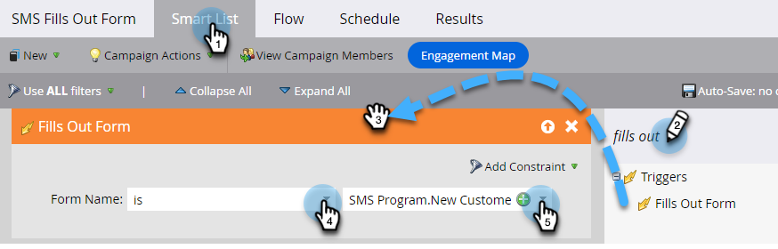

# SMS 메시지 보내기 {#send-a-vibes-sms-message}

[SMS 메시지를 만들었습니다](/help/marketo/product-docs/mobile-marketing/vibes-sms-messages/create-an-sms-message.md){target="_blank"}. 이제 메시지를 보낼 차례입니다. 일괄 처리 또는 트리거 캠페인을 통해 전송할 수 있습니다.

>[!NOTE]
>
>SMS 메시지를 보낼 때:
>
>* Marketo Engage은 전화 번호로 중복 제거됩니다. 따라서 여러 사람이 동일한 전화 번호를 사용하는 경우 한 사람만 Vibes 구독 목록에 가입되어 있는 경우 메시지를 받게 됩니다. 데이터 중복 제거는 Marketo 프로그램 수준이 아닌 Vibes 구독 목록 수준에서 수행됩니다.
>* Marketo은 차단 목록에 추가된 또는 마케팅 중단 대상자에게 보내지 않습니다.
>* Vibes 모바일 데이터베이스 목록에 없는 경우 구독을 취소한 사용자에게는 SMS 메시지가 전송되지 않습니다.

## 일괄 SMS 보내기 {#send-a-batch-sms}

1. 내 Marketo에서 **마케팅 활동**&#x200B;을 클릭합니다.

   

1. 원하는 스마트 캠페인을 찾아 선택합니다.

   

1. **스마트 목록** 탭을 클릭하고 SMS 대상자를 정의합니다. 이 예에서는 &quot;Adobe&quot;가 회사로 나열된 데이터베이스의 모든 사용자에게 를 보냅니다.

   

1. **흐름** 탭에서 **SMS 메시지 보내기** 위로 끌어서 놓습니다. 드롭다운에서 원하는 SMS 메시지 및 보기 목록을 선택합니다.

   

   >[!NOTE]
   >
   >Vibes 목록 선택기는 Smart List에서 이미 식별된 대상자에 대한 추가 필터 역할을 하여 해당 Vibes 목록에 속하는 사람만 타겟팅합니다.

1. **예약** 탭을 클릭하고 SMS를 예약합니다.

   

## 트리거 SMS 보내기 {#send-a-trigger-sms}

1. 내 Marketo에서 **마케팅 활동**&#x200B;을 클릭합니다.

   

1. 원하는 스마트 캠페인을 찾아 선택합니다.

   

1. **스마트 목록** 탭을 클릭하고 원하는 트리거를 선택한 다음 해당 값을 정의합니다. 이 예제에서는 **양식 작성**&#x200B;을 사용합니다.

   

1. **흐름** 탭에서 **SMS 메시지 보내기** 위로 끌어서 놓습니다. 드롭다운에서 원하는 SMS 메시지 및 보기 목록을 선택합니다.

   

   >[!NOTE]
   >
   >Vibes 목록 선택기는 Smart List에서 이미 식별된 대상자에 대한 추가 필터 역할을 하여 해당 Vibes 목록에 속하는 사람만 타겟팅합니다.

1. **일정** 탭을 클릭한 다음 **활성화**&#x200B;를 클릭합니다.

   

>[!MORELIKETHIS]
>
>* [공개 메시지 만들기](/help/marketo/product-docs/mobile-marketing/vibes-sms-messages/create-an-sms-message.md){target="_blank"}
>* [스마트 캠페인에서 SMS 옵션 사용](/help/marketo/product-docs/mobile-marketing/vibes-sms-messages/using-sms-options-in-a-smart-campaign.md){target="_blank"}
