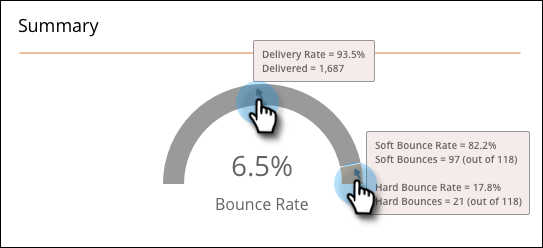

# SMS 보고 {#sms-reporting}

SMS 메시지 대시보드는 메시지에 대한 유용한 분석을 제공합니다.

## 대시보드 액세스 {#access-the-dashboard}

1. 보고를 보려면 원하는 SMS 메시지를 선택합니다. **보기** 드롭다운을 클릭하고 **대시보드**&#x200B;를 선택합니다.

   

1. 대시보드가 나타납니다.

   

## 대시보드 개요 {#dashboard-overview}

### SMS 진행률 {#sms-progression}

보낸 총 수와 배달된 총 수를 표시합니다. 금액은 오른쪽에 있으며 막대 위에 마우스를 가져다 대면 백분율이 표시됩니다.

### 요약 {#summary}

계산된 바운스 비율을 백분율로 표시합니다. 금액 및 백분율별 게재 비율을 보려면 탐색 표시줄에 마우스를 가져다 대십시오. 막대의 주황색 바운스 비율 섹션 위로 마우스를 가져가면 소프트 및 하드 바운스 비율 금액/백분율을 볼 수 있습니다.

### 시간 경과에 따른 활동 {#activity-over-time}

[보낸 총 수] 또는 [배달된 총 수]를 선택할 수 있습니다. 날짜 범위 선택기에서 적절한 범위를 선택합니다.

