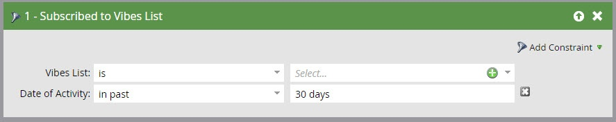

# 스마트 목록 트리거 및 필터에서 Vibes SMS 메시지 사용 {#use-vibes-sms-messages-in-smart-list-triggers-and-filters}

Vibes SMS 메시지 [를 만든](create-a-vibes-sms-message.md)후 스마트 캠페인 내에서 스마트 목록 트리거 및 필터를 사용하여 이점을 얻을 수 있습니다. 방법

1. 내 마켓에서 **마케팅 활동을 클릭합니다**.

   

1. SMS 자산을 사용할 스마트 캠페인을 선택합니다. 자주 사용하는 채우기 양식과 같은 트리거 **위로 드래그합니다**.

   

## SMS 트리거 {#sms-triggers}

사용 가능한 다른 SMS 트리거가 있습니다. SMS 트리거는 Vibes 서비스가 활성화된 경우에만 나타납니다.

여기 몇 가지 예가 있습니다.

SMS 메시지 바운스 트리거는 SMS 메시지가 바운스될 때 이메일 전송과 같은 흐름을 시작합니다.

[ **방문자 목록** 가입] 트리거는 사용자가 가입한 경우 흐름을 시작합니다.

SMS 메시지**에서 링크를 클릭하면 SMS 메시지의 링크를 클릭할 때 흐름이 시작됩니다.

## SMS 필터 {#sms-filters}

스마트 목록에서 시각적 필터를 사용할 수도 있습니다. [ **방문 목록** 가입] 필터는 Vibes에 *가입한* 모든 사람을 찾습니다. 여기에는 삭제된 사람이 흐름에서 생략되더라도 구독 취소 및 삭제된 사람이 모두 포함됩니다. 이 필터는 보고에 가장 적합합니다.

대조적으로, **비브 목록 **필터****** 멤버는 Vibes에 가입된 **사람** ***현재Vibe가 스마트 캠페인 또는 목록에 가장 적합한* 사람을찾습니다.

>[!NOTE]
>
>모든 SMS 필터는 기본적으로 활동 **날짜** 제한을 포함합니다.

스마트 목록에서 Vibes 트리거 및 필터를 설정한 후 흐름을 [정의할 수 있습니다](add-a-flow-step-for-sms.md).

>[!MORELIKETHIS]
>
>* [스마트 캠페인에 대한 스마트 목록 정의 | 트리거](../../../product-docs/core-marketo-concepts/smart-campaigns/creating-a-smart-campaign/define-smart-list-for-smart-campaign-trigger.md)
>* [스마트 목록에 필터 찾기 및 추가](../../../product-docs/core-marketo-concepts/smart-lists-and-static-lists/creating-a-smart-list/find-and-add-filters-to-a-smart-list.md)
>* [SMS용 흐름 단계 추가](add-a-flow-step-for-sms.md)

>

