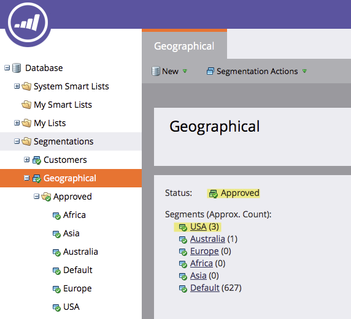

# 세그먼테이션 승인 {#approve-a-segmentation}

세그멘테이션을 사용하려면 먼저 승인을 받아야 합니다.

>[!PREREQUISITES]
>
>* [세그멘테이션 만들기](create-a-segmentation.md)
>* [세그먼트 규칙 정의](define-segment-rules.md)

>

1. **데이터베이스**&#x200B;로 이동합니다.

   

1. 세그멘테이션에서 **세그멘테이션 작업**&#x200B;을 클릭한 다음 **승인**&#x200B;을 클릭합니다.

   

   >[!NOTE]
   >
   >승인이 진행되는 동안 상태가 스피닝 휠로 승인( )으로 변경됩니다.

   >[!CAUTION]
   >
   >데이터베이스 크기에 따라 승인을 완료하는 데 몇 분에서 하루 이상 걸릴 수 있습니다.

   승인되면 상태가 승인에서 승인됨으로 변경됩니다.
   

   >[!TIP]
   >
   >각 세그먼트에 있는 사람의 수는 세그먼트 이름 옆에 괄호로 표시됩니다.

1. 이제 **세그먼트**&#x200B;의 **사람** 탭에 세그먼트에 대한 최종 사용자 목록이 표시됩니다.

   

>[!CAUTION]
>
>세그멘테이션에서 만들 수 있는 총 세그먼트 수는 사용된 필터의 수와 유형 및 세그먼트의 논리가 얼마나 복잡한지에 따라 달라집니다. 표준 필드를 사용하여 최대 100개의 세그먼트를 만들 수 있지만, 다른 유형의 필터를 사용하면 복잡성이 가중되고 세그멘테이션이 승인되지 않을 수 있습니다. 예를 들면 다음과 같습니다.사용자 지정 필드, 목록 구성원, 리드 소유자 필드 및 매출 단계
>
>승인 중에 오류 메시지가 표시되고 세그멘테이션의 복잡성을 줄이는 데 도움이 필요한 경우 [Marketing Support](http://docs.marketo.com/cdn-cgi/l/email-protection#93e0e6e3e3fce1e7d3fef2e1f8f6e7fcbdf0fcfe)에 문의하십시오.

>[!MORELIKETHIS]
>
>* [스마트 목록에서 세그먼트 필터 사용](use-segment-filters-in-a-smart-list.md)

>

