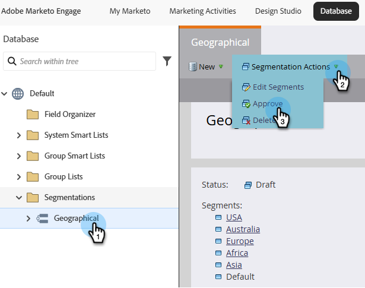
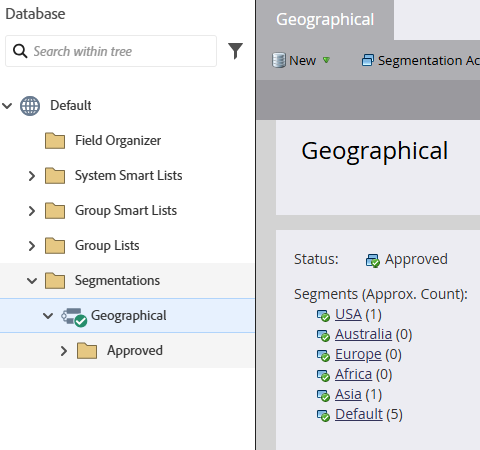

# 세분화 승인 {#approve-a-segmentation}

세그먼테이션을 사용하려면 먼저 승인해야 합니다.

>[!PREREQUISITES]
>
>* [세분화 만들기](/help/marketo/product-docs/personalization/segmentation-and-snippets/segmentation/create-a-segmentation.md)
>* [세그먼트 규칙 정의](/help/marketo/product-docs/personalization/segmentation-and-snippets/segmentation/define-segment-rules.md)

>[!NOTE]
>
>한 번에 최대 20개의 세그먼테이션을 승인할 수 있습니다.

1. **[!UICONTROL Database]**(으)로 이동합니다.

   

1. 세분화에서 **[!UICONTROL Segmentation Actions]**&#x200B;을(를) 클릭한 다음 **[!UICONTROL Approve]**&#x200B;을(를) 클릭합니다.

   

   >[!NOTE]
   >
   >승인이 진행되는 동안 상태가 _승인 중_(으)로 변경됩니다.

   >[!CAUTION]
   >
   >데이터베이스 크기에 따라 승인을 완료하는 데 몇 분에서 하루나 이틀 정도 걸릴 수 있습니다.

1. 승인되면 [!UICONTROL Status]이(가) [!UICONTROL Approving]에서 [!UICONTROL Approved]&#x200B;(으)로 변경됩니다.

   

   >[!TIP]
   >
   >각 세그먼트의 사람 수는 세그먼트 이름 옆에 대괄호로 표시됩니다.

1. 이제 **[!UICONTROL Segment]**&#x200B;의 **[!UICONTROL People]** 탭에 세그먼트에 대한 최종 사용자 목록이 표시됩니다.

   

>[!CAUTION]
>
>세그먼테이션에서 만들 수 있는 총 세그먼트 수는 사용된 필터의 수와 유형 및 세그먼트의 로직이 얼마나 복잡한지에 따라 다릅니다. 표준 필드를 사용하여 최대 100개의 세그먼트를 만들 수 있지만 다른 유형의 필터를 사용하면 복잡성이 증가하여 세그먼테이션이 승인되지 않을 수 있습니다. 일부 예는 사용자 정의 필드, 목록 멤버, 리드 소유자 필드 및 수익 단계입니다.
>
>승인 중에 오류 메시지가 표시되고 세분화의 복잡성을 줄이는 데 도움이 필요한 경우 [Marketo 지원](https://nation.marketo.com/t5/Support/ct-p/Support)에 문의하십시오.

>[!MORELIKETHIS]
>
>[스마트 목록에서 세그먼트 필터 사용](/help/marketo/product-docs/personalization/segmentation-and-snippets/segmentation/use-segment-filters-in-a-smart-list.md)
