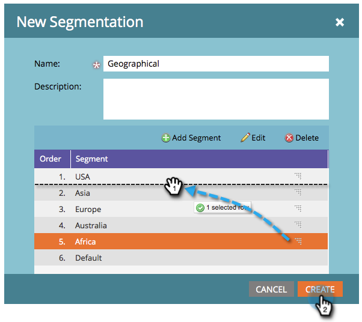

# 세그멘테이션 만들기 {#create-a-segmentation}

세그먼테이션을 사용하면 보고 및 동적 컨텐츠를 위해 개별 프로필로 사람들을 그룹화할 수 있습니다. 만드는 방법을 소개합니다.

1. 데이터베이스로 **이동합니다**.

   

1. **새로 만들기 **를 클릭한 다음 **새 세그멘테이션을 클릭합니다**.

   

   >[!TIP]
   >
   >최대 20개의 세그먼트를 만들 수 있습니다.

1. 이름 **을**&#x200B;입력하고** 세그먼트 추가**를 **클릭하고** 이름을 지정합니다.

   

   >[!NOTE]
   >
   >기본값은 이동, 편집 또는 삭제할 수 없습니다.

1. 원하는 만큼(최대 100개) 세그먼트를 추가합니다.

   

   >[!CAUTION]
   >
   >세그멘테이션에서 만들 수 있는 총 세그먼트 수는 사용된 필터의 수와 유형 및 세그먼트의 논리가 얼마나 복잡한지에 따라 달라집니다. 표준 필드를 사용하여 최대 100개의 세그먼트를 만들 수 있지만, 다른 유형의 필터를 사용하면 복잡성이 가중되고 세그멘테이션이 승인되지 않을 수 있습니다. 예를 들면 다음과 같습니다.사용자 지정 필드, 목록 구성원, 리드 소유자 필드 및 매출 단계
   >
   >
   >승인 중에 오류 메시지가 발생하고 세그멘테이션의 복잡성을 줄이는 데 도움이 필요한 경우 Marketing [To 지원](http://docs.marketo.com/cdn-cgi/l/email-protection#e794929797889593a78a86958c829388c984888a)팀에 문의하십시오.

1. 세그먼트를 드래그하여 놓아 순서를 변경합니다. 완료되면 만들기를 **클릭합니다**.

   

   >[!NOTE]
   >
   >정의된 순서로 일치하는 첫 번째 세그먼트를 [사용할 수](segmentation-order-priority.md) 있습니다.

   >[!NOTE]
   >
   >**미리 알림**
   >
   >
   >세그멘테이션을 사용하려면 먼저 세그먼트 규칙을 정의해야 합니다.

   >[!NOTE]
   >
   >**관련 문서**
   >
   >    
   >    
   >    * [세그먼트 규칙 정의](define-segment-rules.md)

축하합니다! 동적 컨텐츠 사용에 한 단계 더 다가왔습니다.