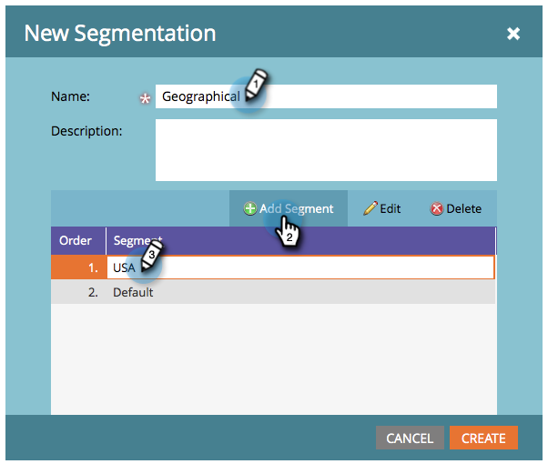

# 세그멘테이션 만들기 {#create-a-segmentation}

세그멘테이션을 사용하면 사람을 보고 및 동적 컨텐츠를 위해 개별 프로필로 그룹화할 수 있습니다. 만드는 방법은 다음과 같습니다.

1. 이동 **데이터베이스**.

   

1. 클릭 **새로 만들기** 그리고 **새 세그멘테이션**.

   

   >[!TIP]
   >
   >최대 20개의 세그먼트를 만들 수 있습니다.

1. 을(를) 입력합니다. **이름**&#x200B;를 클릭합니다. **세그먼트 추가** 이름을 대라.

   

   >[!NOTE]
   >
   >기본값은 이동, 편집 또는 삭제할 수 없습니다.

1. 세그먼트를 원하는 만큼 추가합니다(최대 100개).

   

   >[!CAUTION]
   >
   >세그먼테이션에서 만들 수 있는 총 세그먼트 수는 사용된 필터의 수 및 유형과 세그먼트의 논리가 얼마나 복잡한지에 따라 다릅니다. 표준 필드를 사용하여 최대 100개의 세그먼트를 만들 수 있지만 다른 유형의 필터를 사용하면 복잡성이 높아지며 세그먼테이션을 승인하지 못할 수 있습니다. 예를 들면 다음과 같습니다. 사용자 정의 필드, 목록 멤버, 리드 소유자 필드 및 수익 단계.
   >
   >승인 중에 오류 메시지가 표시되고 세그멘테이션의 복잡도를 줄이는 데 도움이 필요한 경우 [Marketo 지원](https://nation.marketo.com/t5/Support/ct-p/Support).

1. 세그먼트를 드래그하여 놓아 순서를 변경합니다. 완료되면 을(를) 클릭합니다 **만들기**.

   

   >[!NOTE]
   >
   >한 사람이 [주문](/help/marketo/product-docs/personalization/segmentation-and-snippets/segmentation/segmentation-order-priority.md) 정의됩니다.

   >[!NOTE]
   >
   >세그멘테이션을 사용하려면 먼저 세그먼트 규칙을 정의해야 합니다.

   축하합니다! 다이내믹 컨텐츠 사용에 한 단계 더 가까워집니다.

   >[!MORELIKETHIS]
   >
   >[세그먼트 규칙 정의](/help/marketo/product-docs/personalization/segmentation-and-snippets/segmentation/define-segment-rules.md)
