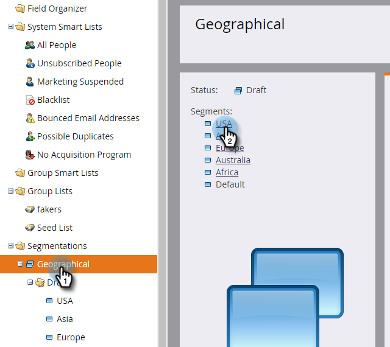

# 세그먼트 규칙 정의 {#define-segment-rules}

세그먼트 규칙 정의를 사용하면 고객을 다른 상호 배타적인 그룹으로 분류할 수 있습니다.

>[!PREREQUISITES]
>
>[세그멘테이션 만들기](create-a-segmentation.md)

1. 데이터베이스로 **이동합니다.**

   

1. 트리에서 **세그멘테이션**을 클릭한 다음 특정 세그먼트를 **클릭합니다**.

   

1. 스마트 목록 **을** 클릭하고 필터를 추가합니다.

   

   >[!CAUTION]
   >
   >현재 세그먼트는 필터에 *대해 [과거* ] 및 *기간 *연산자를 지원하지 않습니다. 변경 데이터 값이 기록될 때만 세그먼테이션에서 업데이트를 확인할 수 있기 때문입니다. 이러한 값은 공식 필드 및 날짜와 같이 자동으로 변경되는 항목에 대해서는 기록되지 *않습니다* . 또한 상대 날짜 범위의 날짜 연산자는 세그멘테이션 승인 시 계산되기 때문에 데이터 값 변경 작업 시점의 데이터가 아니라 지원되지 않습니다.

   >[!NOTE]
   >
   >&quot;SFDC 유형&quot; 및 &quot;Microsoft 유형&quot; 필터는 현재 세그멘테이션 스마트 목록에서 지원되지 않습니다.

1. 필터에 적절한 값을 채웁니다.

   

   >[!NOTE]
   >
   >**자세히 알아보기**
   >
   >
   >스마트 목록은 멋진 기능입니다. 스마트 목록 및 정적 목록 [을 사용하여 수행할 수 있는 모든 작업을 알아봅니다](http://docs.marketo.com/display/docs/smart+lists+and+static+lists).

1. 이 세그먼트 **의** 회원이 될 수 있는 사람을 보려면 사람(초안) 탭을 클릭합니다.

   

1. 세그멘테이션 **작업으로 이동합니다**. 승인을 **클릭합니다**.

   

   >[!CAUTION]
   >
   >세그멘테이션에서 만들 수 있는 총 세그먼트 수는 사용된 필터의 수와 유형 및 세그먼트의 논리가 얼마나 복잡한지에 따라 달라집니다. 표준 필드를 사용하여 최대 100개의 세그먼트를 만들 수 있지만, 다른 유형의 필터를 사용하면 복잡성이 가중되고 세그멘테이션이 승인되지 않을 수 있습니다. 예를 들면 다음과 같습니다.사용자 지정 필드, 목록 구성원, 리드 소유자 필드 및 매출 단계
   >
   >
   >승인 중에 오류 메시지가 발생하고 세그멘테이션의 복잡성을 줄이는 데 도움이 필요한 경우 Marketing [To 지원](http://nation.marketo.com/t5/Support/ct-p/Support)팀에 문의하십시오.

1. 적용된 규칙뿐만 아니라 파이 차트에서 세그먼트에 대한 빠른 개요를 보려면 대시보드를 확인합니다.

   

잘했어! 이러한 세그먼트는 Marketing To의 많은 곳에서 유용하게 사용할 수 있습니다.

>[!NOTE]
>
>한 사람은 다른 세그먼트에 자격이 있을 수 있지만 결국 세그먼트의 [우선순위 순서에 따라 결정되는 한 곳에 속합니다](segmentation-order-priority.md).

>[!NOTE]
>
>**미리 알림**
>
>사람(초안) 화면은 회원이 될 자격이 있고 항상 최종 사용자 목록이 아닌 모든 사람을 표시합니다. 최종 목록을 보려면 세그먼트를 승인합니다.

>[!NOTE]
>
>**관련 문서**
>
>* [세그멘테이션 승인](approve-a-segmentation.md)

>

