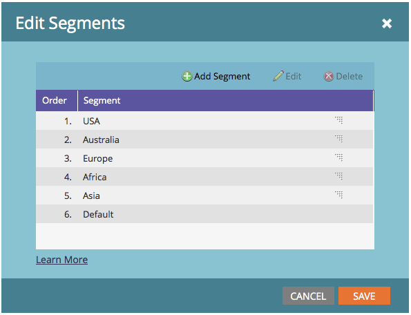

# 세분화 편집 {#edit-a-segmentation}

기존 세그먼트를 쉽게 변경할 수 있습니다. 여기 낮은 것이 있습니다.

## 세그먼테이션 초안 만들기 {#create-a-segmentation-draft}

1. **[!UICONTROL Database]**(으)로 이동합니다.

   

1. 세분화에서 **[!UICONTROL Segmentation Actions]**&#x200B;을(를) 클릭한 다음 **[!UICONTROL Create Draft]**&#x200B;을(를) 클릭합니다.

   

1. **[!UICONTROL Status]**&#x200B;이(가) [!UICONTROL Approved with Draft]&#x200B;(으)로 변경됩니다. 세분화에 **[!UICONTROL Draft]** 폴더가 만들어졌습니다.

   

## 세그먼트 추가, 편집 또는 삭제 {#add-edit-or-delete-segments}

1. 세분화에서 **[!UICONTROL Segmentation Actions]**&#x200B;을(를) 클릭한 다음 **[!UICONTROL Edit Segments]**&#x200B;을(를) 클릭합니다.

   

   >[!NOTE]
   >
   >[!UICONTROL Draft]의 세그먼트만 편집할 수 있으며 승인된 세그멘테이션은 편집할 수 없습니다.

1. **[!UICONTROL Add Segment]**, **[!UICONTROL Edit]**&#x200B;개의 기존 세그먼트(이름 변경 또는 순서 변경) 또는 **[!UICONTROL Delete]**&#x200B;개의 모든 세그먼트.

   

   >[!NOTE]
   >
   >세그먼트를 편집하거나 삭제하려면 먼저 선택해야 합니다.

   >[!CAUTION]
   >
   >삭제는 이메일, 랜딩 페이지 및 스니펫의 연결된 모든 동적 컨텐츠에 영향을 줍니다. **실행 취소가 없습니다**. 해당 세그먼트를 사용하는 항목을 보려면 **[!UICONTROL Used By]** 탭을 확인하십시오.

## 세그먼트 규칙 편집 {#edit-segment-rules}

1. [!UICONTROL Draft] **세그먼트**&#x200B;에서 **[!UICONTROL Smart List]**(으)로 이동합니다. [세그먼트 규칙 정의](/help/marketo/product-docs/personalization/segmentation-and-snippets/segmentation/define-segment-rules.md)와 유사한 규칙을 적용합니다.

   

   >[!NOTE]
   >
   >승인된 세그먼트는 편집할 수 없습니다. [!UICONTROL Draft] 폴더의 세그먼트를 클릭하여 편집하십시오.

   >[!NOTE]
   >
   >세그먼테이션 초안을 승인해야 합니다.

다이내믹 컨텐츠에 사용되지 않는 세그먼트를 자유롭게 실험해 보십시오.

>[!MORELIKETHIS]
>
>[세그먼테이션 삭제](/help/marketo/product-docs/personalization/segmentation-and-snippets/segmentation/delete-a-segmentation.md)
