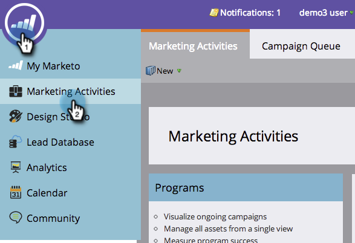

# 세그먼트별로 이메일 보고서 그룹화 {#group-email-reports-by-segmentations}

세그먼테이션은 동적 컨텐츠에만 국한되지 않습니다. 세그먼트별로 [이메일 성과 보고서](../../../../product-docs/email-marketing/email-programs/email-program-data/email-performance-report.md) 를 [그룹화할](http://docs.marketo.com/display/docs/segmentation+and+snippets)수도 있습니다.

>[!PREREQUISITES]
>
>* [세그멘테이션 승인](approve-a-segmentation.md)

>

1. 마케팅 활동 **(또는** 분석 **) 영역으로**&#x200B;이동합니다.

   

1. 이메일 **성과** 보고서를 선택합니다.

   

1. 설정 **탭을** 클릭하고 세그먼트별 **그룹 위로 드래그합니다**.

   

1. 보고서를 그룹화하는 데 사용할 하나 또는 두 개의 세그먼트를 선택합니다. 적용을 **클릭합니다**.

   

1. 바로 그거야! 보고서 **탭을** 클릭합니다. 하나의 세그먼테이션을 사용하는 경우 보고서에는 각 세그먼트에 대해 하나의 행이 표시됩니다.

   

1. 두 개의 세그먼트를 사용하는 경우 각 세그먼트 *조합에 대해 하나의 행을* 표시합니다.

   

>[!NOTE]
>
>**관련 문서**
>
>* [이메일 보고서에서 자산 필터링](../../../../product-docs/reporting/basic-reporting/report-activity/filter-assets-in-an-email-report.md)

>

