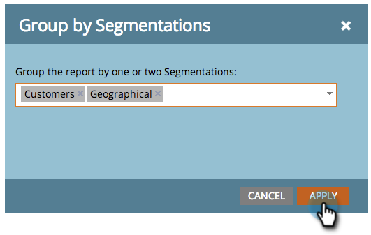

# 세그먼트별로 전자 메일 보고서 그룹화 {#group-email-reports-by-segmentations}

세그먼테이션은 다이내믹 콘텐츠에만 적용되는 것이 아닙니다. 이메일 성과 보고서를 세그먼트별로 그룹화할 수도 있습니다.

>[!PREREQUISITES]
>
>[세분화 승인](/help/marketo/product-docs/personalization/segmentation-and-snippets/segmentation/approve-a-segmentation.md)

1. 로 이동 **마케팅 활동** (또는 **분석**) 영역입니다.

   

1. 다음 항목 선택 **이메일 성능** 보고서.

   

1. 다음을 클릭합니다. **설정** 탭하고 위로 드래그 **세그먼트별 그룹화**.

   

1. 보고서를 그룹화하는 데 사용할 하나 또는 두 개의 세그먼트를 선택하십시오. 클릭 **적용**.

   

1. 다 됐습니다! 다음을 클릭합니다. **보고서** 탭. 하나의 세그먼테이션을 사용하는 경우 보고서에는 각 세그먼트에 대해 하나의 행이 표시됩니다.

   

1. 두 개의 세그먼테이션을 사용하는 경우 각 세그먼트에 대해 하나의 행이 표시됩니다 _조합_ 세그먼트.

   

>[!MORELIKETHIS]
>
>[이메일 보고서에서 자산 필터링](/help/marketo/product-docs/reporting/basic-reporting/report-activity/filter-assets-in-an-email-report.md)
