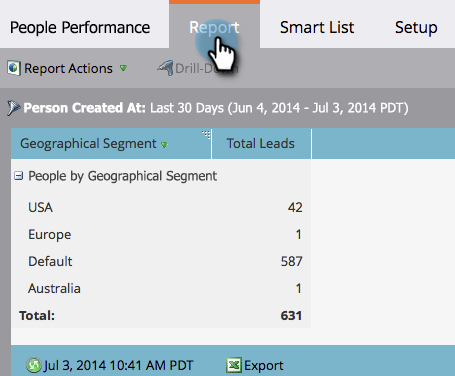

# 세그먼트별 개인 보고서 그룹화 {#group-person-reports-by-segment}

세분화에서 정의한 모든 세그먼트를 기준으로 개인 보고서를 그룹화할 수 있습니다.

1. 다음으로 이동 **마케팅 활동** (또는 **분석**) 섹션에 있는 마지막 항목이 될 필요가 없습니다.

   

1. 탐색 트리에서 개인 보고서를 선택합니다.

   

1. 다음을 클릭합니다. **설정** tab 키 및 두 번 클릭 **사람 그룹화 기준**.

   

   >[!NOTE]
   >
   >다음을 수행할 수도 있습니다. [개인 또는 회사 속성별로 개인 보고서 그룹화](/help/marketo/product-docs/reporting/basic-reporting/report-activity/group-person-reports-by-attribute.md).

1. 다음에서 **사람 그룹화 기준** 대화 상자에서 텍스트 상자에 &#39;Segmentation&#39;을 입력하십시오. 다음의 경우 **세그먼트화** 제목이 나타나면 제목 아래 목록에서 제목을 선택합니다.

   

1. 다음을 클릭합니다. **보고서** 탭으로 이동하여 선택한 세그먼트별로 그룹화된 보고서를 볼 수 있습니다.

   

>[!MORELIKETHIS]
>
>[개인 보고서에 사용자 정의 열 추가](/help/marketo/product-docs/reporting/basic-reporting/editing-reports/add-custom-columns-to-a-person-report.md)
