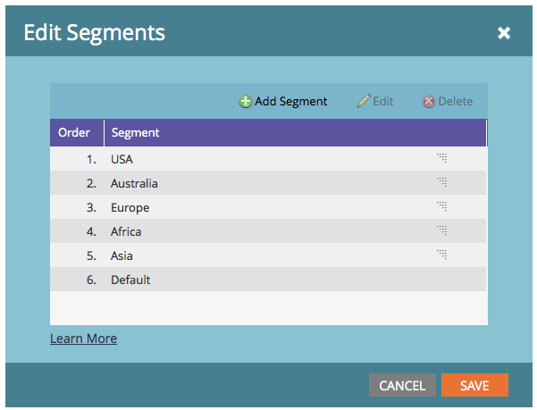

# 세분화 순서 우선 순위 {#segmentation-order-priority}

**order**&#x200B;이(가) 세분화에서 사용자의 평가 우선 순위를 설정하는 방법을 이해하는 것이 중요합니다.

>[!PREREQUISITES]
>
>[세분화 만들기](/help/marketo/product-docs/personalization/segmentation-and-snippets/segmentation/create-a-segmentation.md)
>[세그먼트 규칙 정의](/help/marketo/product-docs/personalization/segmentation-and-snippets/segmentation/define-segment-rules.md)

>[!NOTE]
>
>초안 모드에서만 세그먼테이션을 편집할 수 있습니다.

1. **데이터베이스**(으)로 이동합니다.

   

1. **세그먼테이션**&#x200B;을 선택하세요. **세그먼테이션 작업**&#x200B;에서 **세그먼트 편집**&#x200B;을 클릭하세요.

   

   이 화면에서 세그먼트의 순서를 확인하거나 편집할 수 있습니다.

   

>[!NOTE]
>
>* 세그먼트는 상호 배타적입니다. 한 번에 한 세그먼트만 멤버로 만들 수 있습니다.
>* 한 사람이 두 개의 세그먼트에 대한 자격이 되면 목록의 첫 번째 세그먼트에만 속하게 됩니다.
>* 어떤 세그먼트에도 적합하지 않은 사람은 기본 세그먼트의 구성원이 됩니다.
