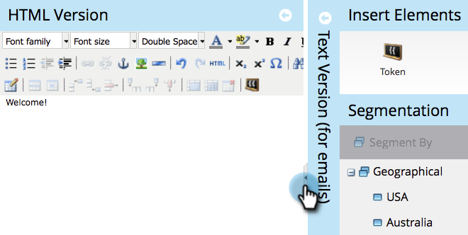

# 코드 조각에 컨텐츠 추가 {#add-content-to-a-snippet}

>[!PREREQUISITES]
>
>[코드 조각 만들기](create-a-snippet.md)

토큰, 이미지, 파일 또는 리치 텍스트를 코드 조각에 추가할 수 있습니다.

>[!NOTE]
>
>코드 조각에 [Marketing](/help/marketo/product-docs/email-marketing/general/email-editor-2/email-template-syntax.md) 이메일 구문을 포함할 수 없습니다.이메일은 작동하지 **않습니다** . 코드 조각은 본문 내용(HTML + TEXT)이어야 합니다.

1. Design **Studio로 이동합니다.**

   

1. 코드 **조각을** 선택하고 **초안 편집을 클릭합니다**.

   

코드 조각에 세 가지 유형의 컨텐츠를 추가할 수 있습니다.

## 토큰 추가 {#add-token}

1. 토큰 **요소를** 드래그하여 놓습니다.

   

1. 토큰 **을** 입력하고 **삽입을 클릭합니다**.

   

## 이미지/파일 추가 {#add-image-file}

1. 이미지/파일 **요소를 드래그하여** 놓습니다.

   

   >[!NOTE]
   >
   >Marketing to에 자신의 이미지 또는 파일을 추가할 수 있습니다. 이미지와 [파일에 대한 자세한 내용을 살펴보십시오](http://docs.marketo.com/display/docs/images+and+files).

1. 사용할 **이미지를** 선택하고 삽입을 **클릭합니다**.

   

   >[!NOTE]
   >
   >이름을 알고 있는 경우 특정 이미지를 검색할 수도 있습니다.

## 텍스트 추가 {#add-text}

1. 텍스트를 추가하려면 HTML 버전 영역을 입력합니다.

   

   >[!TIP]
   >
   >서식 지정 툴을 사용하여 텍스트를 사용자 정의할 수 있습니다.

1. 이메일의 경우 **텍스트 버전** 탭을 클릭합니다.

   

1. HTML에서 **복사를 클릭합니다**.

   

   >[!NOTE]
   >
   >이미지, 링크 및 서식은 텍스트 버전에서 제거됩니다.

좋아! 이제 코드 조각에 사용할 다양한 컨텐츠를 만들 수 있습니다.

>[!MORELIKETHIS]
>
>* [코드 조각 미리 보기](preview-a-snippet.md)
>* [코드 조각 승인](approve-a-snippet.md)

