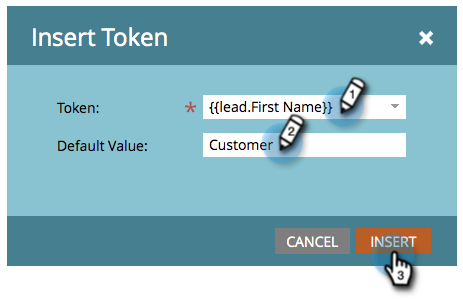

# 코드 조각에 콘텐츠 추가 {#add-content-to-a-snippet}

>[!PREREQUISITES]
>
>[코드 조각 만들기](/help/marketo/product-docs/personalization/segmentation-and-snippets/snippets/create-a-snippet.md)

토큰, 이미지, 파일 또는 서식 있는 텍스트를 코드 조각에 추가할 수 있습니다.

>[!NOTE]
>
>포함할 수 없는 항목 [Marketo 이메일 구문](/help/marketo/product-docs/email-marketing/general/email-editor-2/email-template-syntax.md) 스니펫에서; 그것은 **아님** 이메일에서 작업. 스니펫은 본문 콘텐츠(HTML + 텍스트)여야 합니다.

1. 로 이동 **Design Studio**.

   

1. 다음 항목 선택 **코드 조각** 및 클릭 **초안 편집**.

   

세 가지 유형의 컨텐츠를 코드 조각에 추가할 수 있습니다.

## 토큰 추가 {#add-token}

1. 을(를) 끌어다 놓습니다. **토큰** 요소를 생성하지 않습니다.

   

1. 입력 **토큰** 및 클릭 **삽입**.

   

## 이미지/파일 추가 {#add-image-file}

1. 을(를) 끌어다 놓습니다. **이미지/파일** 요소를 생성하지 않습니다.

   

   >[!NOTE]
   >
   >Marketo에 고유한 이미지 또는 파일을 추가할 수 있습니다. 자세히 알아보기 [이미지 및 파일](/help/marketo/product-docs/demand-generation/images-and-files/add-images-and-files-to-marketo.md).

1. 다음 항목 선택 **이미지** 사용할 항목 및 클릭 **삽입**.

   

   >[!NOTE]
   >
   >이름을 알고 있는 경우 특정 이미지를 검색할 수도 있습니다.

## 텍스트 추가 {#add-text}

1. HTML 버전 영역에 텍스트를 입력합니다.

   

   >[!TIP]
   >
   >서식 도구를 사용하여 텍스트를 사용자 지정합니다.

1. 이메일의 경우 **텍스트 버전** 탭.

   

1. 클릭 **HTML에서 복사**.

   

   >[!NOTE]
   >
   >이미지, 링크 및 서식은 텍스트 버전에서 제거됩니다.

멋지다! 이제 코드 조각에 대한 다양한 콘텐츠를 만들 수 있습니다.

>[!MORELIKETHIS]
>
>* [코드 조각 미리 보기](/help/marketo/product-docs/personalization/segmentation-and-snippets/snippets/preview-a-snippet.md)
>* [코드 조각 승인](/help/marketo/product-docs/personalization/segmentation-and-snippets/snippets/approve-a-snippet.md)
