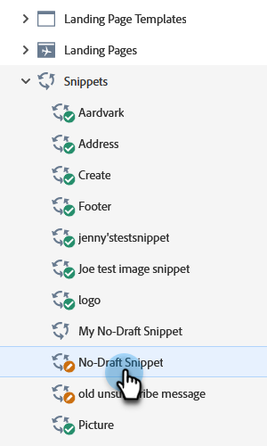

# 초안 없는 스니펫 승인 {#approve-a-snippet-with-no-draft}

## 코드 조각 승인 {#approve-the-snippet}

코드 조각이 승인될 때마다 No-Draft가 트리거됩니다. 여기에는 다른 작업 영역의 에셋에서 공유하거나 참조하는 코드 조각이 포함됩니다.

1. **[!UICONTROL Design Studio]**(으)로 이동합니다.

   

1. 원하는 코드 조각을 찾아 선택합니다.

   

1. **[!UICONTROL Snippet actions]** 드롭다운에서 **[!UICONTROL Approve draft]**&#x200B;을(를) 선택합니다.

   

1. 코드 조각 승인 대화 상자에서 옵션을 선택하고 **[!UICONTROL Approve]**&#x200B;을(를) 클릭합니다.

   * **[!UICONTROL Update all]**: 이 옵션은 코드 조각을 사용하여 승인된 자산의 초안을 만들지 않습니다. 모든 에셋은 업데이트를 받고 이전 상태를 유지합니다. 진행률 모듈이 화면 오른쪽 상단에 표시되며 언제든지 닫을 수 있습니다. 복원하려면 코드 조각 이름을 마우스 오른쪽 단추로 클릭하고 승인 상태 표시를 선택합니다.
   * **[!UICONTROL Create drafts]**: 이 옵션은 코드 조각을 사용하여 승인된 자산의 초안을 만듭니다. 코드 조각 변경 내용을 먼저 검토해야 하는 경우 이 옵션을 선택합니다. 모든 초안은 수동으로 승인해야 합니다.

   

   >[!NOTE]
   >
   >아직 사용되지 않은 새 코드 조각의 경우 이 초안 승인 화면이 표시되지 않습니다. 하나 이상의 에셋에서 코드 조각을 사용하면 표시됩니다.

>[!CAUTION]
>
>이 기능은 코드 조각 승인 작업 과정을 통해 시간을 절약하도록 설계되었습니다. 그러나 알아야 할 몇 가지 제한 사항이 있습니다. 자세한 내용은 [이 문서](https://nation.marketo.com/t5/knowledgebase/no-draft-snippet-limitations-and-troubleshooting/ta-p/300799){target="_blank"}을(를) 참조하십시오.

>[!MORELIKETHIS]
>
>[코드 조각에 대한 초안 없음 사용](/help/marketo/product-docs/administration/users-and-roles/enable-no-draft-for-snippets.md){target="_blank"}
