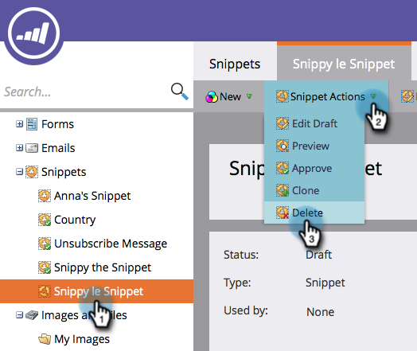

# 코드 조각 삭제 {#delete-a-snippet}

>[!NOTE]
>
>**사전 요구 사항**
>
>* [코드 조각 승인 취소](unapprove-a-snippet.md)

>

더 이상 필요하지 않은 코드 조각을 삭제합니다.

1. Design **Studio로 이동합니다.**

   

1. 코드 조각으로 이동한 다음 코드 조각 작업 아래에서 **삭제를** **클릭합니다**.

   

1. **삭제 **를 클릭하여 확인하거나 **취소를 수행합니다**.

   

   >[!NOTE]
   >
   >**미리 알림**
   >
   >
   >승인되지 않고 자산에 사용되지 않는 코드 조각만 삭제할 수 있습니다.

완료! 검색할 수 없으므로 삭제 단추를 클릭하기 전에 확인하십시오.
