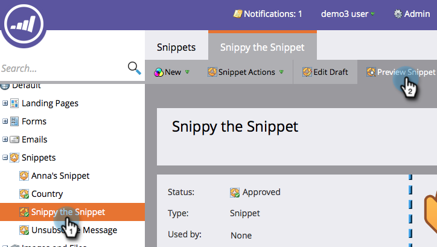

# 코드 단편 미리 보기 {#preview-a-snippet}

>[!PREREQUISITES]
>
>* [조각에 컨텐츠 추가](add-content-to-a-snippet.md)

>

코드 조각은 세그멘테이션 규칙에 따라 변경되는 동적 컨텐츠 블록입니다.

1. **디자인 스튜디오로 이동합니다.**

   

1. 코드 조각을 클릭한 다음 **코드 단편 미리 보기**.

   

미리 보기는 각 세그먼트에서 내용이 제대로 표시되는지 확인하는 데 유용합니다.

>[!NOTE]
>
>**관련 문서**
>
>* [코드 단편 승인](approve-a-snippet.md)

>

