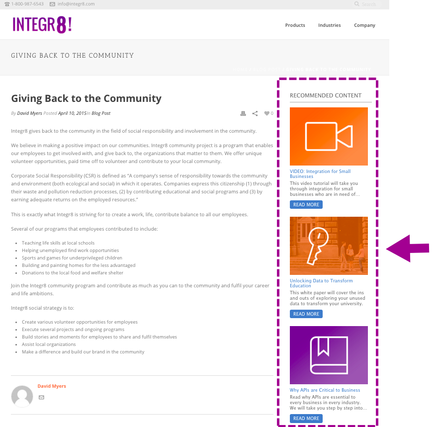

# 웹 리치 미디어용 예측 컨텐츠 활성화 {#enable-predictive-content-for-web-rich-media}

예측 컨텐츠는 머신 러닝과 예측 분석을 통해 관련성이 가장 높은 컨텐츠로 웹 방문자를 매료시킬 수 있습니다. Web Rich Media를 사용하면 텍스트 설명 및 이미지로 컨텐츠를 강화하고 웹 사이트에 다양한 예측 컨텐츠 권장 사항을 포함시킬 수 있습니다.

>[!PREREQUISITES]
>
>예측 컨텐츠를 활성화하려면 먼저 다음을 수행해야 합니다.
>
>* [예측 컨텐츠 준비](http://docs.marketo.com/display/docs/edit+predictive+content)
>* [예측 컨텐트에 대한 제목 승인](/help/marketo/product-docs/predictive-content/working-with-all-content/approve-a-title-for-predictive-content.md)

>

리치 미디어용 컨텐츠 제목, 설명 및 이미지를 준비하면 개별 또는 여러 개의 컨텐츠 조각을 활성화할 수 있습니다.

1. 개별 제목을 활성화하려면 제목을 클릭하여 편집기를 엽니다. 리치 미디어를 클릭한 다음 **리치 미디어의 예측 컨텐트에 대해 활성화** 상자를 선택하고 **저장**&#x200B;을 클릭합니다.

   

1. 여러 컨텐츠의 경우 **예측 컨텐츠** 페이지에서 제목 옆에 있는 상자를 선택합니다.

   

1. **컨텐트 작업** 드롭다운을 클릭하고 **웹 리치 미디어 활성화**&#x200B;를 선택합니다.

   |

## Javascript 코드를 사용자 지정하고 웹 사이트 {#customize-the-javascript-code-and-embed-it-into-your-website}에 포함

Marketing To 개발자 사이트에서 리치 미디어 권장 사항 템플릿 [에 대한 설명서를 참조하십시오.](http://developers.marketo.com/documentation/websites/rtp-rich-media-recommendations-api)웹 사이트의 템플릿을 사용자 지정하는 방법을 설명합니다.

템플릿을 표시할 위치의 웹 사이트에 JavaScript 코드를 붙여넣습니다.

**템플릿 예**

* 템플릿1:이미지, 머리글 및 설명이 포함된 3개의 수평 내용
* 템플릿2:이미지, 머리글 및 설명이 포함된 3개의 세로 컨텐츠 조각

리치 미디어 권장 사항 템플릿1의 예는 다음과 같습니다.

리치 미디어 권장 사항 템플릿2의 예는 다음과 같습니다.

>[!MORELIKETHIS]
>
>* [컨텐츠 권장 사항 막대 활성화](enable-the-content-recommendation-bar.md)
>* [이메일에서 예측 컨텐츠 사용](http://docs.marketo.com/x/vLit)

