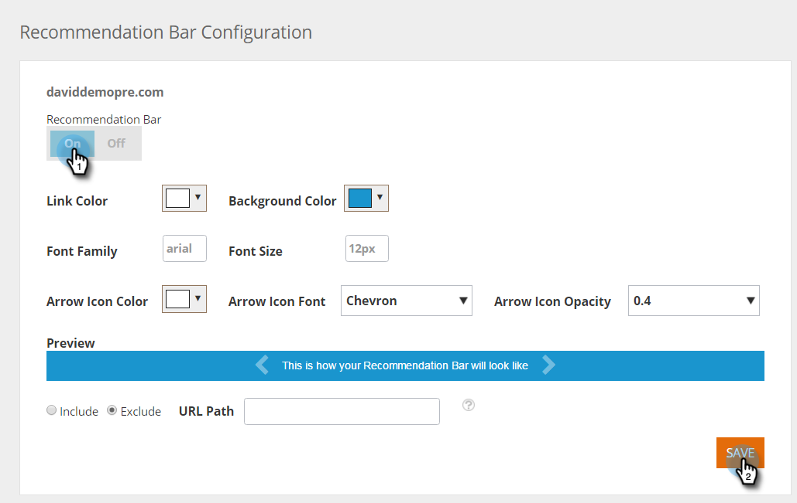

# 컨텐츠 권장 사항 막대 활성화 {#enable-the-content-recommendation-bar}

컨텐츠 추천 엔진은 예측 분석 및 머신 러닝 알고리즘을 사용하여 각 웹 방문자에게 관련 컨텐츠를 제공합니다. 추천 엔진은 방문자당 가장 성과가 좋은 컨텐츠를 예측합니다. 엔진의 컨텐츠는 Recommendations 페이지에서 모니터링하고 제어되므로 컨텐츠 ROI를 최적화할 수 있습니다.

>[!NOTE]
>
>**사전 요구 사항**
>
>예측 컨텐츠를 활성화하려면 먼저 다음을 수행해야 합니다.
>
>* [예측 컨텐츠 준비](http://docs.marketo.com/display/docs/edit+predictive+content)
>* [예측 컨텐츠에 대한 제목 승인](/help/marketo/product-docs/predictive-content/working-with-all-content/approve-a-title-for-predictive-content.md)

## 컨텐츠 권장 사항 막대 활성화 및 사용자 정의 {#enable-and-customize-the-content-recommendation-bar}

1. 콘텐츠 **설정으로 이동합니다**.

   

1. 막대를 **클릭합니다**.

   

1. URL에 대한 권장 사항 막대를 활성화하려면 **켜기** 를 클릭한 다음 **저장을 클릭하면 됩니다**.

   

1. URL을 사용자 정의하려면 색상, 스타일, 형식, 권장 사항 막대의 화살표 및 막대를 포함하거나 제외할 페이지를 선택합니다. 웹 사이트 브랜딩에 맞게 사용자 정의 저장을 **클릭합니다**.

   

   >[!NOTE]
   >
   >**표시 URL 포함/제외**
   >
   >    * 표시 URL은 도메인의 경로여야 합니다.
   >    * http:// 또는 https:// 포함 안 함
   >    * 와일드카드에 * 사용
   * 세미콜론을 구분 문자로 사용
   * 예:/contact_us*;*action=logout*
   * 이 필드는 대/소문자를 구분합니다.

## 권장 사항 막대 고려 사항 {#recommendation-bar-considerations}

* 권장 사항 엔진이 작동하려면 권장 사항 막대가 Recommendations **페이지에서** 켜짐으로 설정된 컨텐츠 조각이 하나 이상 필요합니다. 활성화된 컨텐츠가 없고 막대가 **켜짐으로**&#x200B;설정된 경우 화살표 효과는 웹 페이지의 오른쪽 하단에 표시되지만 권장 컨텐츠는 표시되지 않습니다.

* 권장 사항 엔진에서 더 많은 컨텐츠가 실행될수록 알고리즘이 가장 잘 작동하는 컨텐츠를 테스트하고 학습하는 것이 좋습니다. 10~20개의 콘텐츠 작품이 실행되고 활성화되며 새로운 콘텐츠 요소를 계속 추가하는 것이 좋습니다.
* 권장 사항에 대해 활성화한 컨텐츠 부분에는 RTP Javascript 태그가 포함되어야 합니다. 이렇게 하면 알고리즘이 권장 컨텐츠를 추적하고 최적화할 수 있습니다.

>[!NOTE]
**관련 문서**
* [웹 리치 미디어용 예측 컨텐츠 사용](enable-predictive-content-for-web-rich-media.md)

