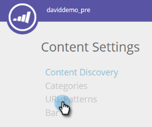

# 컨텐트 패턴 만들기 {#create-content-patterns}

>[!NOTE]
>
>구매 날짜에 따라 마케팅 구독에 Marketing To 예측 컨텐츠 또는 컨텐츠`AI`가 포함될 수 있습니다. 예측 컨텐츠를 사용하는 사용자의 경우 Marketing에서는 2018년 4월 30일까지 컨텐츠`AI` 분석 기능을 활성화합니다. 이러한 기능을 해당 날짜 이상으로 유지하려면 마케팅 고객 성공 관리자에게 문의하여 Marketing To Content`AI`으로 업그레이드하십시오.

컨텐츠 패턴을 설정하면 웹 방문자가 컨텐츠 패턴과 관련된 HTML 웹 페이지를 클릭하면 컨텐츠가 자동으로 검색됩니다. HTML 페이지(블로그 게시물, 보도 자료, 뉴스 기사)를 모든 컨텐츠 페이지에 컨텐츠 조각으로 추가하는 데 사용됩니다. 자동 검색이 컨텐츠 패턴을 기반으로 하는 경우 웹 방문자가 페이지에 대한 링크를 보거나 클릭할 때 정의된 URL 패턴과 관련된 HTML 페이지를 검색하고 추적합니다. 이 컨텐츠 부분(이미지 URL 및 설명을 포함하는 URL, 페이지 이름 및 메타 데이터)이 모든 컨텐츠 페이지에 추가되어 예측 컨텐츠를 준비합니다. PDF 및 포함된 비디오와 같은 다른 컨텐츠를 자동으로 검색하려면 [컨텐츠 검색 활성화](enable-content-discovery.md)해야 합니다.

1. **콘텐츠 설정**&#x200B;으로 이동합니다.

   

1. **URL 패턴**&#x200B;을 클릭합니다.

   

1. 정보를 입력할 수 있는 행을 열려면 **+을 클릭합니다.

   

1. 웹 페이지가 있는 도메인의 URL 확장을 추가합니다. 범주(예: 블로그, 기사, 데이터 시트, 보도 자료)를 선택합니다.

   

   >[!NOTE]
   >
   >오른쪽의 드롭다운 목록에 있는 항목은 [카테고리](set-up-categories.md)를 만들 때 설정한 카테고리를 반영합니다.

1. **+**을 클릭하여 다른 경로를 추가합니다.

   

1. 추가 경로에 대한 확장 및 범주를 추가하고 **저장**&#x200B;을 클릭합니다.

   

## 컨텐트 패턴 규칙 {#content-pattern-rules}

* 표현식의 모든 위치에서 와일드카드를 사용할 수 있습니다(예:*domain.com/**, *domain.com/*blog**)

* 패턴 검색을 계속하려면 표현식 끝에 /*를 사용하는 것이 좋습니다(예:*domain.com/blog/**&#x200B;이(가) 블로그 폴더의 모든 게시물을 검색합니다.
* 컨텐츠 패턴은 대/소문자를 구분하지 않습니다(예:*domain.com/Blog/** domain.com/Blog *및* domain.com/blog *에서 모든 html 페이지를 검색합니다.*

* URL 매개 변수를 찾을 수 없습니다. 이 경우 동일한 컨텐츠 URL을 사용하지만 다른 매개 변수를 사용하는 여러 항목을 검색할 수 없습니다.

## 예 {#examples}

*domain.com*&#x200B;의 경우:

<table> 
 <tbody> 
  <tr> 
   <th>URL 패턴</th> 
   <th>결과</th> 
  </tr> 
  <tr> 
   <td>블로그/*</td> 
   <td>
domain.com/blog/패턴과 일치하는 모든 컨텐츠를 검색합니다.

domain.com/blog/5-top-tricks

domain.com/blog/2017/new-year-solutions

domain.com/Blog/3-best-recipes
</td> 
  </tr> 
  <tr> 
   <td>문서/2017/*</td> 
   <td>
domain.com/article/2017/패턴과 일치하는 모든 컨텐츠를 검색합니다.

domain.com/article/2017/5-top-tricks
</td> 
  </tr> 
  <tr> 
   <td></td> 
   <td>
"데이터시트:"라는 단어가 포함된 URL을 검색합니다.

domain.com/datasheets/5-top-tricks

domain.com/blog/5-top-datasheets
</td> 
  </tr> 
  <tr> 
   <td>보도 자료</td> 
   <td>
정확히 일치하는 HTML 페이지가 하나만 검색됩니다.

domain.com/press-release
</td> 
  </tr> 
  <tr> 
   <td colspan="1"> </td> 
   <td colspan="1">
URL 표현식이 비어 있으면 URL 패턴은 홈 페이지만을 검색합니다.

domain.com
</td> 
  </tr> 
 </tbody> 
</table>

