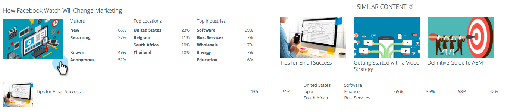

# Predictive Content Analytics 개요 {#predictive-content-analytics-overview}

컨텐츠 분석을 사용하여 기존 컨텐츠에 대한 통찰력을 얻을 수 있고(AI 및 예측 알고리즘 기반) 고객에게 어떤 컨텐츠가 작동하는지 학습하고 마케팅 활동으로 ROI를 높일 수 있습니다.

>[!NOTE]
>
>Analytics 탭 및 컨텐츠 분석 기능은 Marketo 예측 컨텐츠에서만 사용할 수 있습니다.

## 개요 {#overview}

요약 페이지에서 **Analytics**.

Analytics는 다음과 같은 몇 가지 섹션으로 구성됩니다. 뷰별 최상위 컨텐츠, 전환율별 최상위 컨텐츠, 트렌드 컨텐츠, 추천 컨텐츠 및 컨텐츠

자세한 내용은 섹션 헤더의 물음표 위로 마우스를 가져갑니다.

내보내기 단추를 클릭하여 Excel을 통해 해당 섹션의 결과를 내보냅니다.

다양한 속성/속성(예: ABM 계정 목록, 국가 등)별로 결과를 필터링할 수 있습니다.

달력 아이콘을 클릭하여 반영된 데이터의 날짜를 변경합니다. 사전 설정된 시간 또는 특정 날짜 범위를 선택합니다.

## 보기별 상위 컨텐츠 {#top-content-by-views}

선택한 날짜 범위당 보기 횟수별로 상위 컨텐츠 조각을 표시합니다.

## 전환율별 상위 컨텐츠 {#top-content-by-conversion-rate}

선택한 날짜 범위에 대한 전환율별로 상위 전환 콘텐츠를 표시합니다.

>[!NOTE]
>
>**정의**
>
>**전환율**: 직접 전환으로 계산된 비율을 클릭으로 나눈 값입니다.

## 트렌드 콘텐츠 {#trending-content}

동일한 이전 기간에 비해 최근 2주 동안의 보기 횟수를 보면 컨텐츠 부분의 인기가 높아집니다.

## 추천 콘텐츠 {#suggested-content}

정의한 필터를 기반으로 마케팅 활동에서 홍보할 것을 제안하는 콘텐츠를 표시합니다.

추천 컨텐츠의 이미지 위로 마우스를 가져가면 사용 가능한 옵션이 표시됩니다.

>[!NOTE]
>
>맨 아래에 있는 그 아이콘들 보여? 왼쪽 - 오른쪽: 컨텐츠 보기, CSV로 내보내기, 컨텐츠 승인.

## 콘텐츠 {#content}

원하는 컨텐츠 조각을 검색하고 클릭하여 다음을 포함한 추가 세부 사항을 확인합니다. 이 컨텐츠를 보는 방문자, 신규 및 재방문, 알려진 및 익명, 방문자가 컨텐츠를 볼 때 방문자가 도달한 상위 위치 및 유추된 상위 산업이 있습니다.

>[!NOTE]
>
>비슷한 컨텐츠는 선택한 컨텐츠 조각을 기반으로 하며 연결 규칙 알고리즘에 의해 계산됩니다. 결과는 선택한 부분과 이전 방문자 행동에 따라 방문자가 가장 클릭할 수 있는 컨텐츠 조각을 나타냅니다. 필터나 날짜 범위를 고려하지 않습니다.
