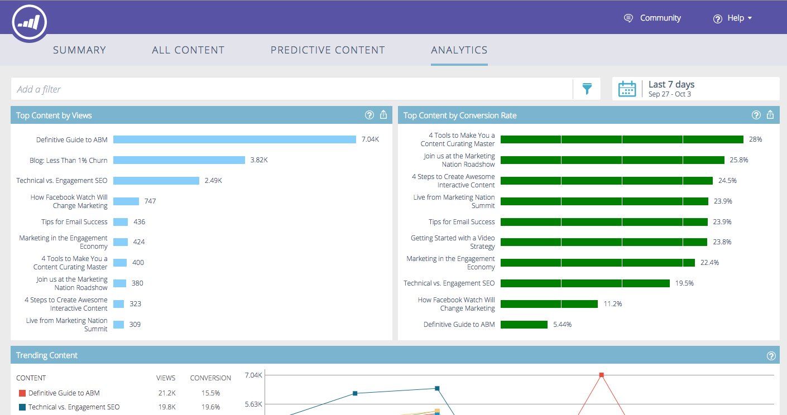

# 예측 컨텐츠 분석 개요 {#predictive-content-analytics-overview}

콘텐츠 분석을 통해 기존 콘텐츠에 대한 통찰력을 얻을 수 있고 AI 및 예측 알고리즘을 기반으로 콘텐츠를 학습하여 고객에게 최적의 콘텐츠를 제공할 수 있으며 마케팅 활동을 통해 ROI를 향상시킬 수 있습니다.

>[!NOTE]
>
>분석 탭 및 컨텐츠 분석 기능은 Marketing To 예측 컨텐츠에서만 사용할 수 있습니다.

## 개요 {#overview}

요약 페이지에서 분석을 클릭합니다.

Analytics는 다음과 같은 여러 섹션으로 구성됩니다.보기별 상위 컨텐츠, 전환율에 따른 상위 컨텐츠, 트렌드 컨텐츠, 제안된 컨텐츠 및 컨텐츠.

자세한 내용은 섹션 헤더의 질문 표시 위로 마우스를 가져갑니다.

내보내기 단추를 클릭하여 Excel을 통해 해당 섹션의 결과를 내보냅니다.

다양한 속성/속성(예: ABM 계정 목록, 국가 등)별로 결과를 필터링할 수 있습니다.

달력 아이콘을 클릭하여 반영된 데이터의 날짜를 변경합니다. 사전 설정된 시간 또는 특정 날짜 범위를 선택합니다.

## 뷰별 상위 콘텐트 {#top-content-by-views}

선택한 날짜 범위당 보기 횟수별로 상위 컨텐츠 조각을 표시합니다.

## 전환율 기준 상위 컨텐츠 {#top-content-by-conversion-rate}

선택한 날짜 범위의 전환율에 따라 전환율이 가장 높은 컨텐츠를 표시합니다.

>[!NOTE]
>
>**정의**
>
>**전환율**:직접 전환을 클릭으로 나눈 백분율입니다.

## 트렌드 콘텐츠 {#trending-content}

동일한 이전 기간과 비교하여 지난 2주 동안의 보기 횟수를 확인하여 컨텐츠 부분의 인기 증가를 표시합니다.

## 제안된 컨텐트 {#suggested-content}

정의한 필터를 기반으로 마케팅 활동에서 홍보할 것을 제안하는 콘텐츠를 표시합니다.

제안된 컨텐츠에서 이미지 위로 마우스를 가져가면 사용 가능한 옵션이 표시됩니다.

>[!NOTE]
>
>**설명**
>
>하단에 있는 아이콘들 보이시죠? 왼쪽에서 오른쪽을 보면 다음과 같습니다.컨텐츠 보기, CSV로 내보내기, 컨텐츠 승인.

## 콘텐트 {#content}

원하는 컨텐츠 조각을 검색하고 클릭하여 다음을 비롯한 추가 세부 사항을 확인합니다.컨텐츠를 보는 방문자, 신규 또는 재방문, 알려진 및 익명의 방문자, 컨텐츠를 볼 때 방문자가 가져온 상위 위치 및 유추된 상위 산업이 있습니다.

>[!NOTE]
>
>유사한 컨텐츠는 선택한 컨텐츠 조각을 기반으로 하며 연결 규칙 알고리즘으로 계산됩니다. 결과는 선택한 부분 및 이전 방문자 행동에 따라 방문자가 가장 많이 클릭하는 컨텐츠 조각을 나타냅니다. 필터 또는 날짜 범위가 고려되지 않습니다.

