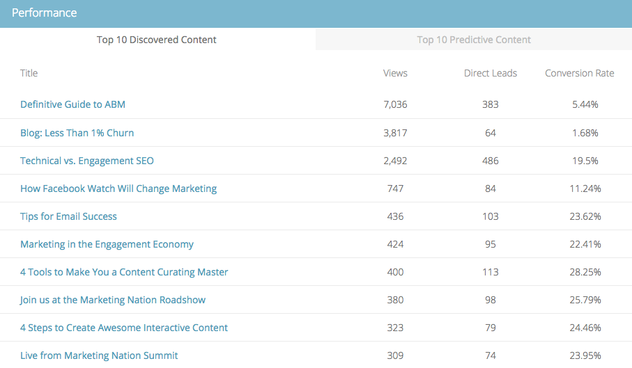

# 예측 콘텐츠 요약 {#the-predictive-content-summary}

예측 콘텐츠 요약에는 표, 그래프 및 현재 숫자와 함께 예측 콘텐츠에 대해 필요한 정보가 한 눈에 표시됩니다.

## 상단 표시줄 {#top-bar}

상단 표시줄에는 컨텐츠 및 보기의 현재 숫자와 활성화된 부분의 수가 표시됩니다. 오른쪽 상단에서 전체 페이지에 대한 지난 7~30일 보기를 선택합니다.

## 성능 테이블 {#performance-table}

다음은 보기, 직접 리드 및 전환율을 포함하여 검색된 상위 10개 콘텐츠를 볼 수 있는 곳입니다.

## [!UICONTROL Predictive Engagement] {#predictive-engagement}

총 클릭 수와 직접 잠재 고객을 비교하여 전환율을 보고 다양한 소스의 성능을 비교할 수 있습니다.

## [!UICONTROL Content Trend by Views]  {#content-trend-by-views}

모든 컨텐츠 보기가 예측 컨텐츠와 어떻게 일치하는지 비교합니다.

## [!UICONTROL Top Categories by Engagement] {#top-categories-by-engagement}

어떤 카테고리의 콘텐츠가 가장 매력적입니까? 이 그래프에서 볼 수 있습니다.

>[!NOTE]
>
>범주 링크(위 이미지의 예: 잠재 고객, 이메일 등)를 클릭하면 클릭한 범주가 필터에 추가된 모든 콘텐츠 페이지가 열리고 해당 범주의 콘텐츠 분석이 표시됩니다.
