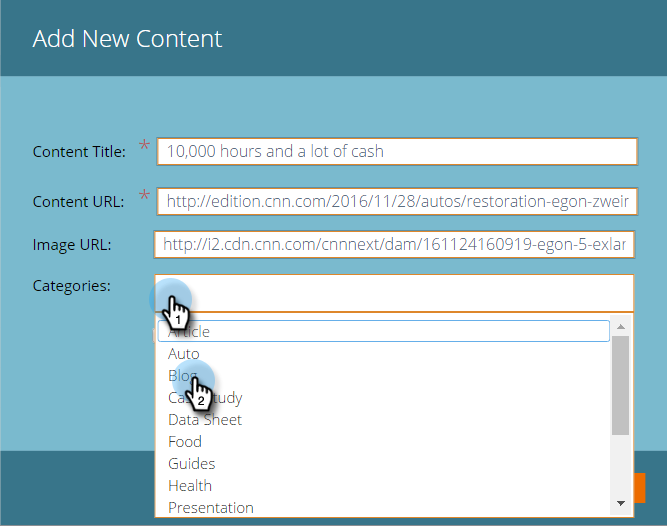

# 새 내용 추가 {#add-new-content}

>[!NOTE]
>
>구매 날짜에 따라 마케팅 구독에 Marketing To 예측 컨텐츠 또는 컨텐츠`AI`가 포함될 수 있습니다. 예측 컨텐츠를 사용하는 사용자의 경우 Marketing에서는 2018년 4월 30일까지 컨텐츠`AI` 분석 기능을 활성화합니다. 이러한 기능을 해당 날짜 이상으로 유지하려면 마케팅 고객 성공 관리자에게 문의하여 Marketing To Content`AI`으로 업그레이드하십시오.

모든 컨텐츠 페이지에 컨텐츠를 수동으로 손쉽게 추가할 수 있습니다.

1. **콘텐츠 추가** 드롭다운을 클릭하고 **콘텐츠 추가**&#x200B;를 선택합니다.

   

1. 제목과 URL을 입력하고 필요한 경우 이미지 URL을 입력합니다.

   

1. 범주를 추가하려면 필드를 클릭하고 드롭다운에서 선택합니다.

   

1. **추가**&#x200B;를 클릭합니다.

   

1. 이제 새 제목이 **모든 콘텐트** 페이지에 표시됩니다. 예측 컨텐트에 대해서는 아직 승인되지 않았습니다.

   

1. [예측 컨텐츠](http://docs.marketo.com/x/Vbet)에 추가하는 방법은 다음과 같습니다.

