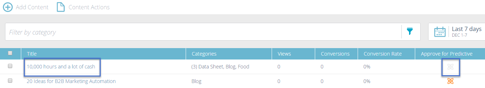

# 새 컨텐츠 추가 {#add-new-content}

모든 컨텐츠 페이지에 컨텐츠를 수동으로 추가할 수 있습니다.

1. 을(를) 클릭합니다. **컨텐츠 추가** 드롭다운 및 선택 **컨텐츠 추가**.

   

1. 제목과 URL을 입력하고 필요한 경우 이미지 URL을 입력합니다.

   

1. 카테고리를 추가하려면 필드를 클릭하고 드롭다운에서 을 선택합니다.

   

1. 클릭 **추가**.

   

1. 이제 새 제목이 **모든 컨텐츠** 페이지. 예측 컨텐츠에 대해서는 아직 승인되지 않았습니다.

   

1. 여기에 추가하는 방법은 다음과 같습니다 [Predictive Content](/help/marketo/product-docs/predictive-content/working-with-all-content/approve-a-title-for-predictive-content.md).
