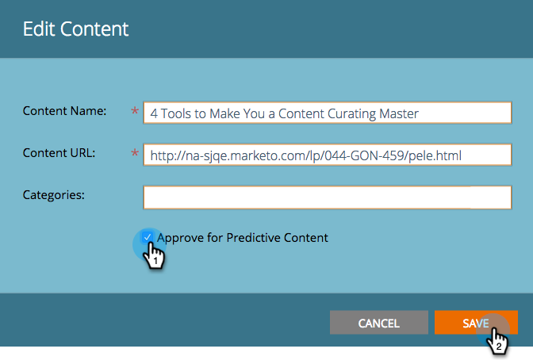

# 예측 콘텐츠 제목 승인 {#approve-a-title-for-predictive-content}

[!UICONTROL All Content] 페이지 또는 [!UICONTROL All Content] 팝업에서 승인하여 [!UICONTROL Edit Content] 페이지의 제목을 예측 콘텐츠에 추가할 수 있습니다.

## [!UICONTROL All Content] 페이지 {#all-content-page}

1. 콘텐츠 조각 옆에 있는 상자를 선택합니다.

   

1. **[!UICONTROL Content Actions]** 드롭다운을 클릭하고 **[!UICONTROL Approve for Predictive Content]**&#x200B;를 선택합니다.

   

## [!UICONTROL Edit Content] 팝업 {#edit-content-pop-up}

[!UICONTROL Edit Content] 팝업에서 바로 예측 콘텐츠의 제목을 승인할 수도 있습니다.

1. 컨텐츠 위로 마우스를 가져간 후 행 끝에 있는 편집 아이콘을 클릭합니다.

   

1. **[!UICONTROL Approve for Predictive Content]** 팝업에서 [!UICONTROL Edit Content] 상자를 선택하고 **[!UICONTROL Save]**&#x200B;을(를) 클릭합니다.

   

어떤 방법을 사용하든 이제 [!UICONTROL Approve for Predictive Content] 아이콘이 행에 표시됩니다.

이제 [!UICONTROL Predictive Content] 페이지에 제목이 표시됩니다.

