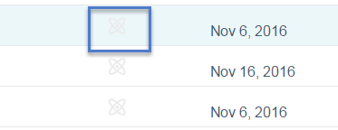

# 예측 컨텐츠 {#unapprove-a-title-for-predictive-content}에 대한 제목 승인 취소

>[!NOTE]
>
>구매 날짜에 따라 마케팅 구독에 Marketing To 예측 컨텐츠 또는 컨텐츠`AI`가 포함될 수 있습니다. 예측 컨텐츠를 사용하는 사용자의 경우 Marketing에서는 2018년 4월 30일까지 컨텐츠`AI` 분석 기능을 활성화합니다. 이러한 기능을 해당 날짜 이상으로 유지하려면 마케팅 고객 성공 관리자에게 문의하여 Marketing To Content`AI`으로 업그레이드하십시오.

모든 컨텐츠 페이지 또는 컨텐츠 편집 팝업에서 예측 컨텐트에 대한 제목을 승인하지 않을 수 있습니다.

## 모든 콘텐츠 페이지 {#all-content-page}

1. 모든 컨텐츠 페이지에서 컨텐츠 조각 옆의 상자를 선택하여 선택합니다.

   

1. **컨텐츠 작업** 드롭다운을 클릭하고 **예측 컨텐츠 승인 취소**&#x200B;를 선택합니다.

   

## 내용 편집 팝업 {#edit-content-pop-up}

편집하는 동안 제목을 승인하지 않을 수 있습니다.

1. 콘텐츠 위로 마우스를 가져간 다음 행 끝에 있는 편집 아이콘을 클릭합니다.

   

1. **예측 컨텐트에 대한 승인** 상자의 선택을 취소하고 **저장**&#x200B;을 클릭합니다.

   

어떤 방법을 사용하든 모든 컨텐츠 페이지에 승인 아이콘이 표시되며 예측 컨텐츠 페이지에서 제목이 사라집니다.

