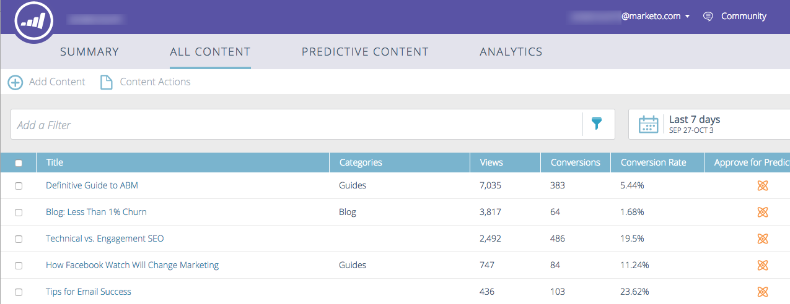
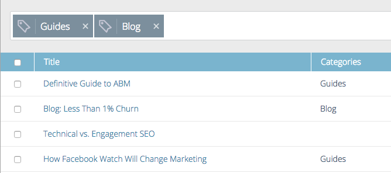

# 모든 콘텐츠 이해 {#understanding-all-content}

모든 컨텐츠 페이지에는 수동으로 검색되거나 추가된 모든 컨텐츠가 표시됩니다.

페이지 필드에는 다음이 포함됩니다.

* **[!UICONTROL Title]**: 콘텐츠의 이름
* **[!UICONTROL Categories]**: 사용자가 만들고 웹 또는 전자 메일에 대한 예측 결과를 그룹화하는 데 사용됨
* **[!UICONTROL Views]**: 검색된 웹 콘텐츠에 대한 총 클릭 수(모든 소스 포함)
* **[!UICONTROL Conversions]**: 동일한 방문에서 콘텐츠 조각을 보고 양식을 완료한 방문자 수
* **[!UICONTROL Conversion Rate]**: 직접 전환으로 계산된 비율을 클릭수로 나눈 값입니다.
* **[!UICONTROL Approve for Predictive]**: 콘텐츠가 승인되면 아이콘이 표시됩니다.

새 컨텐츠를 추가하고 추적하거나 컨텐츠를 제거하거나 컨텐츠를 승인할 수 있습니다. 콘텐츠를 승인한 후 예측 콘텐츠 페이지에서 편집할 수 있습니다.

## 카테고리별 컨텐츠 필터링  {#filter-content-by-categories}

하나 이상의 카테고리를 선택하여 콘텐츠를 필터링합니다. 그런 다음 표준 또는 사용자 지정 설정을 사용하여 콘텐츠 분석에 대한 날짜 또는 날짜 범위를 설정합니다.

1. **[!UICONTROL All Content]** 페이지에서 필터 아이콘을 클릭하고 **[!UICONTROL Category]**&#x200B;에서 하나 이상의 콘텐츠 범주를 선택합니다.

   

1. 이제 해당 카테고리의 콘텐츠만 표시됩니다.

   

## 날짜 또는 날짜 범위에 대한 분석 표시 {#display-analytics-for-a-date-or-date-range}

1. 특정 날짜 또는 날짜 범위에 대한 데이터를 표시하려면 달력 아이콘을 클릭한 다음 왼쪽 패널에서 를 선택합니다. 사용자 지정 날짜 범위의 경우 캘린더에서 날짜 범위의 첫 번째 날과 마지막 날을 클릭합니다(표시된 대로). **[!UICONTROL Apply]**&#x200B;을(를) 클릭합니다.

   

1. 이제 선택한 날짜 범위의 콘텐츠에 대해 분석이 표시됩니다.

>[!MORELIKETHIS]
>
>* [새 콘텐츠 추가](/help/marketo/product-docs/predictive-content/working-with-all-content/add-new-content.md)
>* [콘텐츠 삭제](/help/marketo/product-docs/predictive-content/working-with-all-content/delete-content.md)
>* [예측 콘텐츠의 제목 승인](/help/marketo/product-docs/predictive-content/working-with-all-content/approve-a-title-for-predictive-content.md)
>* [예측 콘텐츠에 대한 제목 승인 취소](/help/marketo/product-docs/predictive-content/working-with-all-content/unapprove-a-title-for-predictive-content.md)
