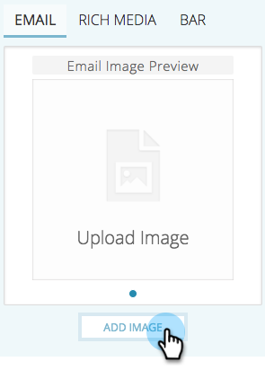

# 이메일에 대한 예측 콘텐츠 편집 {#edit-predictive-content-for-emails}

이메일에 대한 예측 콘텐츠를 설정하는 방법은 다음과 같습니다.

>[!PREREQUISITES]
>
>[ 페이지에서 ](/help/marketo/product-docs/predictive-content/working-with-all-content/approve-a-title-for-predictive-content.md)예측 콘텐츠에 대해 승인[!UICONTROL All Content]된 콘텐츠여야 합니다.

1. [!UICONTROL Predictive Content] 페이지에서 제목을 클릭하여 편집기를 엽니다.

   

1. 편집 페이지가 열립니다. 기본적으로 **[!UICONTROL Email]**&#x200B;이(가) 표시됩니다.

   

   >[!NOTE]
   >
   >제목과 URL이 이미 채워져 있습니다. 원하는 내용인지 확인합니다.

1. 단추 레이블을 추가/편집하려면 오른쪽에 있는 텍스트 상자에 을 입력합니다.

   

   >[!NOTE]
   >
   >단추 레이블을 변경한 경우 변경 사항을 저장하거나 이미지를 미리 볼 때 업데이트됩니다.

1. 이미지 URL을 추가하거나 편집하려면 **[!UICONTROL Edit Image]**&#x200B;을(를) 클릭합니다.

   

   >[!CAUTION]
   >
   >최상의 품질을 보장하려면 이미지가 400x400픽셀 이하여야 합니다.

1. 이미지 URL을 삽입하고 **[!UICONTROL Add]**&#x200B;을(를) 클릭합니다.

   

1. 슬라이더를 클릭하고 드래그하여 이미지 크기를 변경합니다. 그런 다음 자르기 상자를 클릭하고 드래그하여 사용할 이미지 영역을 분리합니다. 완료되면 **[!UICONTROL Preview]**&#x200B;을(를) 클릭합니다.

   

1. 측면에 있는 화살표를 클릭하여 스크롤하고 각 이메일 레이아웃 미리 보기에서 콘텐츠를 봅니다(두 가지 옵션이 표시됨).

   |  |  |
   |---|---|

1. 필요한 경우 **[!UICONTROL Categories]** 필드를 클릭하고 콘텐츠에 범주를 추가합니다. 옵션은 이미 설정한 [범주](/help/marketo/product-docs/predictive-content/getting-started/set-up-categories.md)에서 가져온 것입니다.

   

1. 이메일에서 예측 콘텐츠를 활성화하려면 상자를 선택합니다.

   

1. **[!UICONTROL Save]**&#x200B;을(를) 클릭합니다.

   

   >[!NOTE]
   >
   >Marketo 전자 메일 편집기 v2.0에서는 콘텐츠를 활성화하는 동안 사용하는 [레이아웃 템플릿을 봅니다](/help/marketo/product-docs/predictive-content/enabling-predictive-content/enable-predictive-content-in-emails.md)할 수도 있습니다.
