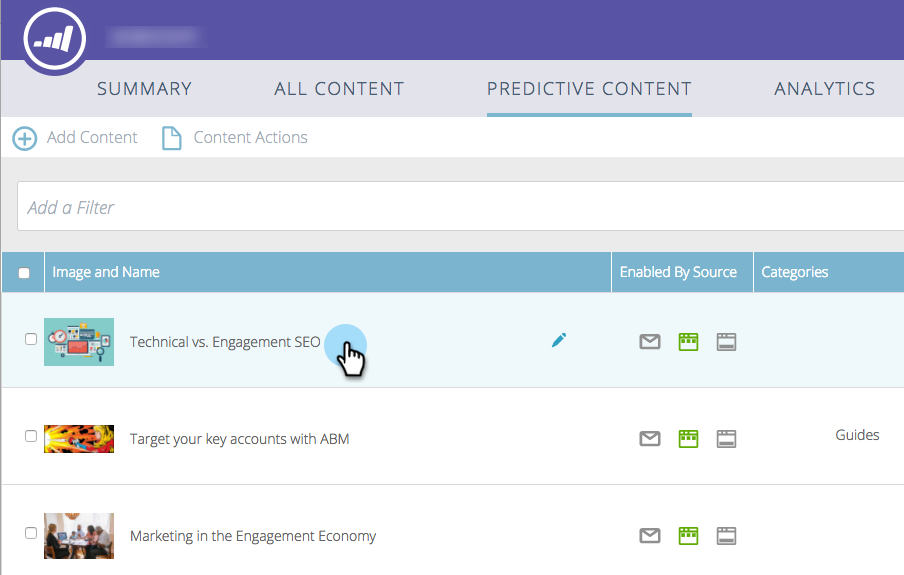

# 권장 사항 모음 {#edit-predictive-content-for-the-recommendation-bar}에 대한 예측 컨텐츠 편집

>[!NOTE]
>
>구매 날짜에 따라 마케팅 구독에 Marketing To 예측 컨텐츠 또는 컨텐츠AI가 포함될 수 있습니다. 예측 컨텐츠를 사용하는 사용자의 경우 Marketing에서는 2018년 4월 30일까지 컨텐츠AI 분석 기능을 활성화합니다. 이러한 기능을 해당 날짜 이상으로 유지하려면 마케팅 고객 성공 관리자에게 문의하여 Marketing To ContentAI로 업그레이드하십시오.

다음은 권장 사항 막대에 대한 예측 컨텐츠를 설정하는 방법입니다.

>[!PREREQUISITES]
>
>모든 컨텐츠 페이지에서 예측 컨텐츠](/help/marketo/product-docs/predictive-content/working-with-all-content/approve-a-title-for-predictive-content.md)에 대해 컨텐츠가 [승인되어야 합니다.

1. **예측 컨텐츠** 페이지에서 제목을 클릭하여 편집기를 엽니다.

   

1. **막대**&#x200B;를 클릭합니다.

   

1. 권장 사항 표시줄에서 예측 컨텐츠를 활성화하려면 이 상자를 선택합니다.

   

1. **저장**&#x200B;을 클릭합니다.

   
