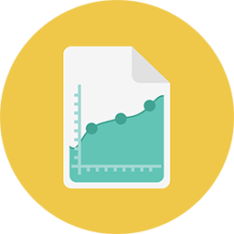

# {#reporting} 보고

실행 가능한 통찰력. 이것이 바로 Marketing To 보고의 결과입니다. 받은 편지함으로 바로 배달할 수도 있습니다.
** 기본 보고** [기본 보고 시작: 이메일, 웹 및 사람 보고서, 맙소사!](https://docs.marketo.com/display/DOCS/Basic+Reporting)     **  Analytics** Revenue Cycle Analytics  [Revenue Cycle Analytics시간 시리즈 데이터 분석을 통해 보다 까다로워집니다.](https://docs.marketo.com/display/DOCS/Revenue+Cycle+Analytics)     **  통찰력 성과 통찰력**  [성과 통찰력 모든 캠페인 성과 KPI를 한 곳에서 볼 수 있습니다.](https://docs.marketo.com/display/DOCS/Marketing+Performance+Insights)     **  인사이트 이메일 인사이트**  [이메일 인사이트 내역 데이터를 사용하여 강력한 통찰력을 얻을 수 있습니다.](https://docs.marketo.com/display/DOCS/Email+Insights)