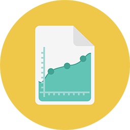

# 보고 {#reporting}

실행 가능한 인사이트입니다. 이것이 바로 Marketo 보고를 통해 얻을 수 있는 것입니다. 받은 편지함으로 바로 전달되도록 설정할 수도 있습니다.
**기본 보고** [기본 보고 기본 사항부터 시작합니다. 전자 메일, 웹 및 개인 보고서, 이런!](https://docs.marketo.com/display/DOCS/Basic+Reporting)     **수익 주기 분석** [수익 주기 분석 시계열 데이터 분석으로 하드코어 이동](https://docs.marketo.com/display/DOCS/Revenue+Cycle+Analytics)     **성능 인사이트** [성능 인사이트 모든 캠페인 성능 KPI를 한 곳에서 봅니다.](https://docs.marketo.com/display/DOCS/Marketing+Performance+Insights)     **이메일 인사이트** [이메일 인사이트 내역 데이터를 사용하여 강력한 인사이트를 탐색합니다.](https://docs.marketo.com/display/DOCS/Email+Insights)
