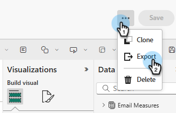
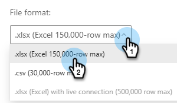

# 고급 BI Analytics 개요 {#advanced-bi-analytics-overview}

고급 BI Analytics(이전 이름: Revenue Explorer 및 고급 Report Builder)는 Marketo Engage 데이터에 대한 유연한 보고 및 시각화 인터페이스를 제공하여 진행 상황, 성능 등에 대한 세부 정보를 제공합니다. 더욱 풍부한 상호 작용 및 시각화, 빠른 성능, 보다 원활하고 직관적인 사용자 경험을 제공합니다.

이러한 향상된 기능을 통해 시간을 절약하고, 보다 중요한 통찰력을 발견하고, 최적화를 추진하고, 동료 및 관련자와 보다 매력적인 데이터 스토리를 공유할 수 있습니다.

>[!PREREQUISITES]
>
>이 기능에 액세스하려면 고급 BI Analytics 추가 기능을 구입해야 합니다. 자세한 내용은 Adobe 계정 팀(계정 관리자)에 문의하십시오.

## 주요 기능 및 이점 {#key-features-and-benefits}

* **고성능 쿼리 엔진**: 대규모 데이터 세트에서 5배 더 빠른 성능을 제공하여 더 빠른 데이터 처리, 더 빠른 보고서 로드 및 더 원활한 분석 환경을 가능하게 합니다.

* **풍부하고 매력적인 시각화**: 차트, 맵 및 KPI 지표를 포함하여 방대한 확장된 기본 제공 시각화 옵션 컬렉션으로 대시보드를 보다 통찰력 있고 효과적이며 데이터 스토리텔링을 크게 향상시킵니다.

* **고급 상호 작용 및 동적 필터링**: 시각적 개체에 동적 슬라이서, 상호 필터링 및 상호 종속 필터를 적용합니다. 다중 페이지 보고서는 고급 드릴다운, 드릴업 및 드릴스루를 지원하므로 데이터 탐색을 쉽게 수행할 수 있습니다.

* **직관적인 보고서 작성 인터페이스**: 포인트 앤 클릭 방식으로 여러 페이지로 구성된 드릴스루 보고서를 포함하여 보고서 작성을 단순화합니다. 사용자는 인터페이스를 통해 복잡한 대화형 보고서를 설계할 때 기술적인 전문 지식이 필요하지 않습니다.

* **간편한 공유, PowerPoint 내보내기 포함**: 기본 제공 공유 기능을 통해 인사이트를 손쉽게 공유할 수 있습니다. 여러 대상 중에서 프레젠테이션 준비가 완료된 PowerPoint 슬라이드를 손쉽게 생성할 수 있습니다.

## 보고서 만들기 {#create-a-report}

1. 내 Marketo에서 **[!UICONTROL Advanced BI Analytics]** 타일을 클릭합니다.

   {width="800" zoomable="yes"}

1. **[!UICONTROL Reports]** 탭에서 **[!UICONTROL Create Report]**&#x200B;을(를) 클릭합니다.

   {width="800" zoomable="yes"}

1. 원하는 측정값을 선택합니다.

   {width="800" zoomable="yes"}

1. 원하는 차원을 선택합니다.

   {width="800" zoomable="yes"}

1. 원하는 시각화를 선택합니다.

   {width="800" zoomable="yes"}

1. 차원 속성을 드래그 앤 드롭하여 필터를 추가합니다.

   {width="800" zoomable="yes"}

## 보고서 내보내기 {#export-a-report}

전체 보고서를 내보낼 때 내보내기 옵션은 PDF 및 PPT입니다. .XLS 또는 .CSV로 데이터가 필요한 경우 개별 시각화를 내보내면 됩니다([아래 참조](#export-a-visualization)).

>[!BEGINTABS]

>[!TAB 보고서 페이지에서]

1. 보고서 페이지에서 원하는 보고서의 &#39;자세히&#39; 아이콘(...)을 클릭하고 **내보내기**&#x200B;를 선택합니다.

   

1. PDF 또는 PPT를 선택하고 **내보내기**&#x200B;를 클릭합니다.

   

>[!TAB 보고서 내]

1. 보고서 자체 내에서 오른쪽 상단의 &#39;자세히&#39; 아이콘(**...**)을 클릭하고 **내보내기**&#x200B;를 선택합니다.

   

1. PDF 또는 PPT를 선택하고 **내보내기**&#x200B;를 클릭합니다.

   

>[!ENDTABS]

### 시각화 내보내기 {#export-a-visualization}

보고서의 특정 섹션을 내보내는 방법을 알아봅니다.

1. 원하는 보고서를 선택합니다.

   {width="600" zoomable="yes"}

1. 표시된 시각화 위로 마우스를 가져가 세 개의 아이콘을 표시합니다.

   {width="600" zoomable="yes"}

1. &#39;기타&#39; 아이콘(**..**)을 클릭합니다.

   

1. **데이터 내보내기**&#x200B;를 선택합니다.

   

1. 원하는 데이터 형식을 선택합니다.

   

   >[!NOTE]
   >
   >* _현재 레이아웃이 있는 데이터_&#x200B;는 테이블 및 매트릭스 시각화에만 사용할 수 있습니다.
   >* _기본 데이터_&#x200B;은(는) Marketo Engage에서 사용할 수 없습니다.

1. 원하는 파일 형식(.XLS, .CSV)을 선택합니다.

   

1. **내보내기**&#x200B;를 클릭합니다.

## 비디오 데모 {#video}

다음 비디오를 통해 다중 페이지 드릴스루 보고서 경험의 예를 확인하십시오.

>[!VIDEO](https://video.tv.adobe.com/v/3451689/?quality=12&learn=on&captions=kor){transcript=true}

## 고급 BI Analytics의 표준 보고서 {#standard-reports}

다음 표준 보고서가 사용자 지정 보고서의 예로 포함되어 있습니다.

<table>
  <thead>
    <tr>
      <th>보고 영역</th>
      <th>보고서 이름</th>
    </tr>
  </thead>
  <tbody>
    <tr>
      <td rowspan="8">이메일 분석</td>
      <td>이메일 - 보낸 활동(CST)</td>
    </tr>
    <tr>
      <td>이메일 - 클릭 활동(CST)</td>
    </tr>
    <tr>
      <td>이메일 - 활동 열기(CST)</td>
    </tr>
    <tr>
      <td>이메일 - 클릭된 시간 분포(CST)</td>
    </tr>
    <tr>
      <td>이메일 - 열람율 감소</td>
    </tr>
    <tr>
      <td>이메일 - 개설 시간 분배(CST)</td>
    </tr>
    <tr>
      <td>이메일 - 성능 세부 정보</td>
    </tr>
    <tr>
      <td>이메일 - 클릭률 감소</td>
    </tr>
    <tr>
      <td rowspan="8">잠재 고객 분석</td>
      <td>전환된 잠재 고객별 상위 10개 잠재 고객 소스</td>
    </tr>
    <tr>
      <td>상위 10개 리드 소스</td>
    </tr>
    <tr>
      <td>SLA 위반 보고서</td>
    </tr>
    <tr>
      <td>가망 고객 월령 보고서</td>
    </tr>
    <tr>
      <td>가망 고객 잔액 보고서</td>
    </tr>
    <tr>
      <td>잠재 고객 전환 보고서</td>
    </tr>
    <tr>
      <td>잠재 고객 흐름 보고서</td>
    </tr>
    <tr>
      <td>잠재 고객 전환 시간 보고서</td>
    </tr>
    <tr>
      <td rowspan="5">프로그램 분석</td>
      <td>성공별 상위 10개 프로그램</td>
    </tr>
    <tr>
      <td>총 파이프라인별 상위 10개 프로그램</td>
    </tr>
    <tr>
      <td>프로그램 수익 단계 보고서</td>
    </tr>
    <tr>
      <td>상위 10개 획득 프로그램</td>
    </tr>
    <tr>
      <td>마케팅 채널 투자 트렌드</td>
    </tr>
    <tr>
      <td rowspan="7">영업 기회 분석</td>
      <td>마감된 기회에 대한 마케팅 영향</td>
    </tr>
    <tr>
      <td>기회에 대한 마케팅 영향 마감 성공</td>
    </tr>
    <tr>
      <td>생성된 기회에 대한 마케팅 영향</td>
    </tr>
    <tr>
      <td>(FT) 생성된 기회에 대한 마케팅 영향</td>
    </tr>
    <tr>
      <td>(MT) 영업 기회에 미치는 마케팅 영향 마감 성공</td>
    </tr>
    <tr>
      <td>(MT) 생성된 기회에 대한 마케팅 영향</td>
    </tr>
    <tr>
      <td>(FT) 마케팅 영향력이 마감된 영업 기회에 미침</td>
    </tr>
    <tr>
      <td>영업 기회 리드 분석</td>
      <td>Opportunity 별로 상위 10 명의 리드 소유자 성공</td>
    </tr>
  </tbody>
</table>

## 유의할 사항 {#note}

* 클래식 &quot;Revenue Explorer&quot; 경험은 2025년 6월 10일에 영구적으로 사용되지 않습니다. 그동안 두 경험에서 보고서에 액세스하고 보고서를 만들고 업데이트하며 삭제할 수 있습니다.

* 사용자 지정 보고서는 아래의 [새 경험 학습](#learning-the-new-experience) 섹션에서 언급된 주목할 만한 동작 변경 사항과 함께 클래식 경험에서 새 경험으로 복제됩니다.

  >[!IMPORTANT]
  >
  >사용자 지정 보고서의 복제는 그룹에서 수행됩니다. 사용자 정의 보고서가 새 경험에 복제되면 두 경험 간에 일관성을 유지하기 위해 클래식 경험에서 변경한 사항은 새 경험의 해당 보고서에도 수동으로 적용해야 합니다. 위에 대한 정보 메모는 고객 보고서를 복제할 때 클래식 환경에서 사용할 수 있습니다.

   * 클래식 경험의 대시보드는 양도할 수 없으며 새 경험에서 레크리에이션이 필요합니다. 이 매개 변수는 새 경험에서 보고서로 다시 만들어야 하며 클래식 경험에서 개별적으로 가능한 모든 값을 수동으로 입력할 필요 없이 새 경험의 필터가 자동으로 가능한 값을 가져옵니다.

     >[!NOTE]
     >
     >새 경험의 대시보드는 단순히 단일 페이지에 있는 보고서 컬렉션입니다. 새 경험에서 대시보드의 기본 값은 여러 보고 영역에 걸쳐 분석 인사이트를 제공할 수 있도록 하는 것입니다.

* 클래식 경험의 이메일 구독이 새 경험에 복제됩니다. 클래식 경험의 이메일 구독은 2025년 6월 10일에 클래식 경험의 사용이 중단될 때까지 계속 작동합니다.

* 기존 Revenue Explorer 사용자는 자동으로 새로운 고급 BI Analytics 환경에 액세스할 수 있습니다.

* 고급 BI Analytics에서 **최대 700개의 보고서**&#x200B;를 만들 수 있습니다.

  >[!NOTE]
  >
  >매출 탐색기에 700개가 넘는 보고서가 있는 경우 일부 보고서는 다른 보고서와 결합되고 보고서 내의 페이지를 통해 통합되었습니다.
  >
  >* 보고서에 이메일 구독이 있는 경우 구독이 결합되지 않았습니다.
  >
  >* _동일한 폴더_&#x200B;에 있는 나머지 보고서는 보고 영역별로 하나 이상의 보고서로 결합되었습니다. 신고지역에 대한 신고가 5개보다 많으면 1개보다 많은 취합신고로 통합하였다.
  >
  >* 결합된 각 보고서에는 5페이지를 넘지 않습니다.

* 주어진 시각화에 대해 쿼리당 100만 개의 행으로 제한됩니다. 쿼리가 이를 초과하면 다음 오류가 발생합니다. `The resultset of a query to external data source has exceeded the maximum allowed size of '1000000' rows`. 이 문제를 해결하려면 날짜 범위를 줄이거나 보고서에서 필터를 조정하여 쿼리 결과의 행 수를 줄입니다.

## 새로운 경험 배우기 {#learning-the-new-experience}

새로운 시각화 경험은 임베드된 Power BI 서비스를 통해 제공됩니다.

시각화 경험에 대한 빠른 튜토리얼을 보려면 Microsoft의 [Power BI에서 시각적 개체 사용](https://learn.microsoft.com/en-us/training/modules/visuals-in-power-bi/){target="_blank"} 설명서를 참조하십시오. Marketo Engage에 이러한 모든 기능이 표시되지 않을 수 있습니다.

### 주요 경험 변경 사항 {#notable-experience-changes}

다음은 클래식 경험(매출 탐색기/고급 Report Builder)에서 새 경험(고급 BI Analytics)을 변경한 내용입니다.

* 날짜 유형 필터는 동일한 기능을 하지만 값 지정에 대한 구문은 변경되었습니다. 기존 사용자 정의 보고서에서 모든 날짜 유형 필터 값(&quot;요일&quot;을 제외)은 새 경험에서 해당하는 값으로 자동 변환됩니다. &quot;요일&quot; 값에 대한 지원이 중단되었습니다.

* 이제 문자열 유형 필터는 대/소문자를 구분합니다.

* 클래식 경험의 런타임 공식 필드는 더 이상 지원되지 않습니다.

* 이메일 구독에는 보고서의 HTML이 아닌 PDF 내보내기가 포함됩니다. 새 이메일 구독에는 보고서 정의가 포함되지 않습니다.

* 보고서의 딥링크는 현재 지원되지 않습니다.

* PDF 내보내기는 클래식 경험에서 비동기적이었던 것에 비해 새 경험에서 동기적입니다.

>[!NOTE]
>
>모델 성능 분석(리드) 보고 영역에 둘 이상의 사용자 정의 필드 그룹 필드를 포함할 수 없습니다.

>[!MORELIKETHIS]
>
>[지표 및 차원](/help/marketo/product-docs/reporting/advanced-bi-analytics/metrics-and-dimensions.md){target="_blank"}
