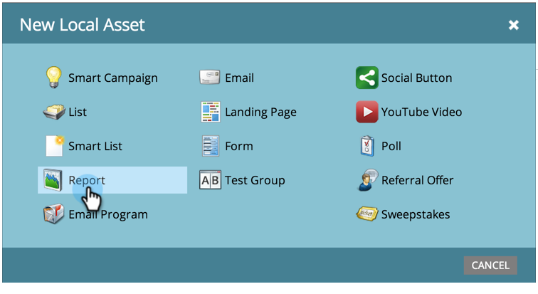

# 프로그램 {#create-a-report-in-a-program}에서 보고서 만들기

보고서를 실행하여 사람, 프로그램, 랜딩 페이지, 이메일 및 소셜 자산을 분석합니다.

1. **마케팅 활동**&#x200B;으로 이동합니다.
1. 

1. 프로그램을 선택합니다.

   

   >[!NOTE]
   >
   >**Analytics** 탭에서 보고서를 만들 수도 있습니다.

   프로그램을 마우스 오른쪽 단추로 클릭하고 [새 로컬 자산]을 선택합니다.

   

1. **보고서**&#x200B;를 클릭합니다.

   

1. 보고서 **유형**&#x200B;을 선택합니다.

   

   >[!TIP]
   >
   >각 항목에 대한 간단한 설명은 [`Report Type Overview`](http://docs.marketo.com/display/DOCS/Report+Type+Overview)을 참조하십시오.

   보고서 이름을 지정합니다.

   

   >[!TIP]
   >
   >나중에 보고서를 보다 쉽게 탐색하려면 이름에 보고서 유형에 대한 참조를 포함시킵니다.

   보고서의 시간대를 설정합니다. 자세한 내용은 [보고서 기간 변경](../../../../product-docs/reporting/basic-reporting/editing-reports/change-a-report-time-frame.md)을 참조하십시오.

1. 통계를 보려면 **보고서** 탭을 클릭합니다.

   

   >[!NOTE]
   >
   >**자세히 알아보기**
   >
   >
   >기본적으로 보고서에는 모든 프로그램 간에 계정의 모든 활동이 포함됩니다. 보고서를 필터링할 수 있는 다양한 방법에 대해 알아보려면 [기본 보고](http://docs.marketo.com/display/docs/basic+reporting) 세부 정보 검색을 참조하십시오.

   >[!NOTE]
   >
   >**미리 알림**
   >
   >
   >많은 보고서를 신속하게 만들 수 있습니다. 더 이상 필요하지 않은 보고서](../../../../product-docs/reporting/basic-reporting/report-activity/delete-a-report.md)를 [삭제해야 합니다.

   >[!MORELIKETHIS]
   >
   >
   >
   >[보고서 시간 프레임](../../../../product-docs/reporting/basic-reporting/editing-reports/change-a-report-time-frame.md), [기본 보고서 구독](../../../../product-docs/reporting/basic-reporting/report-subscriptions/subscribe-to-a-basic-report.md), [보고서를 Excel](../../../../product-docs/reporting/basic-reporting/report-activity/export-a-report-to-excel.md)로 내보내기, [보고서를 스마트 목록](../../../../product-docs/reporting/basic-reporting/editing-reports/filter-people-in-a-report-with-a-smart-list.md) 및 [기타](http://docs.marketo.com/display/docs/basic+reporting)로 보고서의 사람을 필터링할 수 있습니다.

