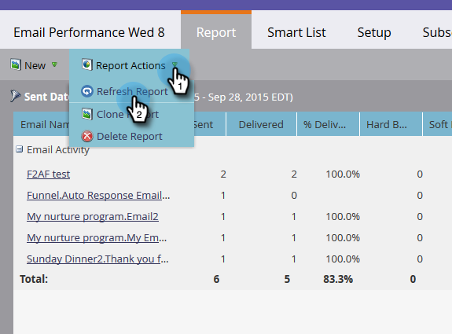

# 보고서 새로 고침 {#refresh-a-report}

보고서를 본 후 Marketing에서는 다음에 볼 때 빠르게 로드되도록 데이터베이스에 저장합니다. 보고서가 24시간마다 자동으로 새로 고쳐져 항상 최신 상태로 유지됩니다. 원할 때마다 수동으로 새로 고칠 수 있습니다.

1. 보고서가 마지막으로 업데이트된 시기를 보려면 왼쪽 하단에 있는 원-화살표 아이콘을 가리킵니다.

   

1. 저 원-화살표 아이콘은 새로 고침 단추입니다. 클릭만으로 최신 결과를 얻을 수 있습니다.

   

1. 보고서 작업 메뉴 **를 클릭하고 보고서 새로 고침** 을 선택하여 보고서를 새로 고칠 수도 있습니다 ****.

   

   Voilà!

