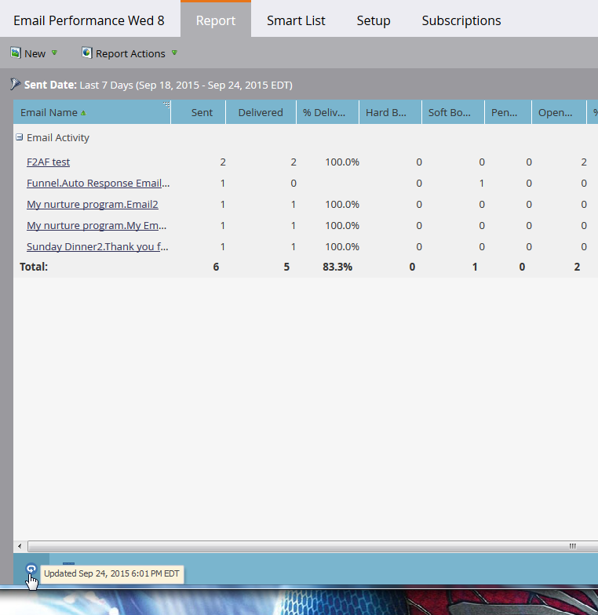

# 보고서 새로 고침 {#refresh-a-report}

보고서를 본 후 Marketo은 다음에 볼 때 빠르게 로드되도록 데이터베이스에 저장합니다. 첫 번째 보기에 따라 보고서는 항상 최신 상태가 되도록 24시간마다 자동으로 새로 고쳐집니다. 하지만 원할 때마다 수동으로 새로 고칠 수 있습니다.

1. 보고서가 마지막으로 업데이트된 시간을 보려면 왼쪽 아래 모서리에 있는 원-화살표 아이콘을 마우스로 가리키십시오.

   

1. 이 원-화살표 아이콘은 새로 고침 단추입니다. 클릭하여 최신 결과를 얻기만 하면 됩니다.

   

1. 을 클릭하여 보고서를 새로 고칠 수도 있습니다 **보고서 작업** 메뉴 및 선택 **보고서 새로 고침**.

   

   불라!
