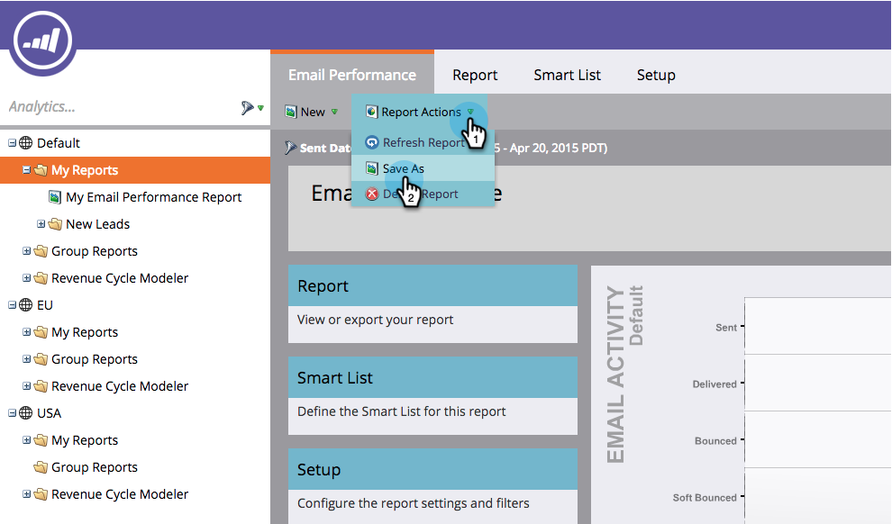
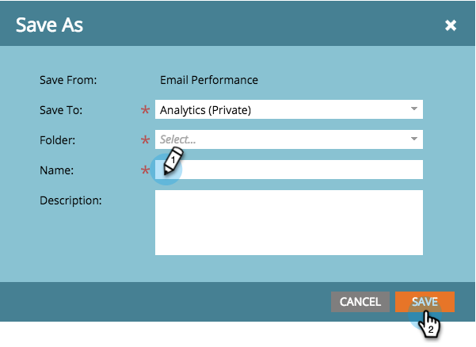

# 보고서 저장 {#save-a-report}

나중에 다시 보려면 기본 보고서를 저장해야 하는 경우가 있습니다. 이를 수행하는 방법은 다음과 같습니다.

1. **[!UICONTROL Analytics]** 영역으로 이동합니다.

   

1. [보고서 유형](/help/marketo/product-docs/reporting/basic-reporting/report-types/report-type-overview.md)을(를) 선택하십시오.

   

1. **[!UICONTROL Report Actions]**&#x200B;을(를) 클릭하고 **[!UICONTROL Save As]**&#x200B;을(를) 선택합니다.

   

1. **[!UICONTROL Save To]** 위치를 선택하고 **[!UICONTROL Folder]**&#x200B;을(를) 선택합니다.

   

1. 보고서를 **[!UICONTROL Name]**&#x200B;하고 **[!UICONTROL Save]**&#x200B;을(를) 클릭합니다.

   

   멋지다! 저장된 보고서가 이제 트리에 표시됩니다.

   

>[!MORELIKETHIS]
>
>보고서를 그룹 보고서에 [복제하는 방법](/help/marketo/product-docs/reporting/basic-reporting/report-activity/clone-a-report-to-group-reports.md)을 알아보세요.
