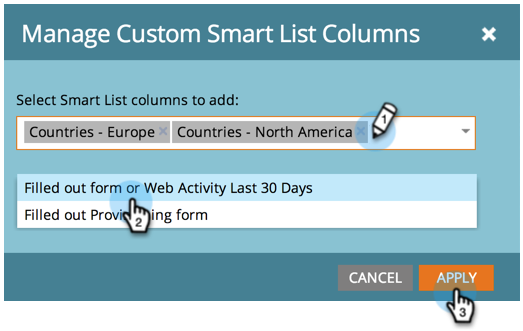

# 사람 보고서에 사용자 지정 열 추가 {#add-custom-columns-to-a-person-report}

[스마트 목록](http://docs.marketo.com/display/docs/smart+lists+and+static+lists)을 사용자 지정 열로 사용하여 [사람 보고서](http://docs.marketo.com/display/docs/basic+reporting)에서 지표를 추가로 필터링할 수 있습니다.

1. **마케팅 활동**(또는 **분석**) 영역으로 이동합니다.

   

1. 보고서를 선택하고 **설정** 탭을 클릭합니다.

   

1. **사용자 지정 열** 위로 드래그합니다.

   

1. 보고서 열로 사용할 스마트 목록을 선택합니다.

   

   >[!NOTE]
   >
   >**자세히 알아보기**
   >
   >
   >[스마트 목록 및 정적 목록](http://docs.marketo.com/display/docs/smart+lists+and+static+lists)의 딥 도우미에서 스마트 목록을 만들고 구성하는 방법을 알아봅니다.

1. 네가 한 거야! **보고서** 탭을 클릭하여 새 열이 있는 보고서를 봅니다.

   

   >[!NOTE]
   >
   >**관련 문서**
   >
   >
   >[리드 보고서에 기회 열 추가](add-opportunity-columns-to-a-lead-report.md)도 가능합니다.

   >[!NOTE]
   >
   >**자세히 알아보기**
   >
   >
   >[기본 보고](http://docs.marketo.com/display/docs/basic+reporting) 세부 조사에서 보고로 수행할 수 있는 많은 작업에 대해 자세히 알아봅니다.

