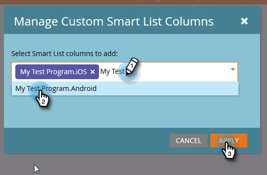

# 모바일 플랫폼 열 {#build-a-people-performance-report-with-mobile-platform-columns}을(를) 사용하여 인물 성능 보고서 만들기

모바일 플랫폼(iOS/Android) 열을 사용하여 사람 성능 보고서를 만들려면 다음 단계를 수행합니다.

## 모바일 스마트 목록 만들기 {#create-mobile-smart-lists}

1. **마케팅 활동**&#x200B;으로 이동합니다.

   

1. 프로그램을 선택합니다.

   

1. **새로 만들기**&#x200B;에서 **새 로컬 자산**&#x200B;을 선택합니다.

   

1. **스마트 목록**&#x200B;을 클릭합니다.

   

1. 이름을 입력하고 **만들기**&#x200B;를 클릭합니다.

   

1. 열린 이메일 필터를 찾아 캔버스로 드래그합니다.

   

1. 이메일을 **으로 설정하면**&#x200B;이 됩니다.

   

1. **제한 추가**&#x200B;를 클릭하고 **플랫폼**&#x200B;을 선택합니다.

   

   >[!TIP]
   >
   >이 예에서는 열린 이메일 필터를 사용했습니다. 클릭한 이메일 필터를 플랫폼 제약 조건으로 사용할 수도 있습니다.

1. 플랫폼을 **iOS**&#x200B;로 설정합니다.

   

   >[!NOTE]
   >
   >Marketing&#39;s가 이메일을 찾기 위해 iOS 장치에서 이메일 중 하나를 연 사람이 한 명 이상 있어야 합니다. 나타나지 않으면 수동으로 입력하고 저장할 수 있습니다.

   이제 &quot;Android&quot; 플랫폼용 두 번째 스마트 목록을 만듭니다. 그게 끝나면 다음 부분으로 이동합니다.

## 사람 성과 보고서 만들기 {#create-a-people-performance-report}

1. 마케팅 활동에서 **iOS** 및 **Android** 스마트 목록이 포함된 프로그램을 선택합니다.

   

1. **새로 만들기**&#x200B;에서 **새 로컬 자산**&#x200B;을 선택합니다.

   

1. **보고서**&#x200B;를 클릭합니다.

   

1. 유형을 **사람 성능**&#x200B;으로 설정합니다.

   

1. **만들기**&#x200B;를 클릭합니다.

   

   잘하고 있어! 이제 다음 섹션으로 넘어갑니다.

## 모바일 스마트 목록을 열 {#add-mobile-smart-lists-as-columns}으로 추가

1. 방금 만든 보고서에서 **설정**&#x200B;을 클릭한 다음 **사용자 지정 열**&#x200B;을 캔버스로 드래그합니다.

   

   >[!NOTE]
   >
   >기본적으로 사람 성과 보고서는 최근 7일을 보고 있습니다. 일정을 두 번 클릭하여 변경할 수 있습니다.

1. 이전에 만든 스마트 목록을 찾아 선택하고 **적용**&#x200B;을 클릭합니다.

   

1. **보고서**&#x200B;를 클릭하여 보고서를 실행하고 데이터를 봅니다.

   

   꽤 멋있죠? 잘했다!

