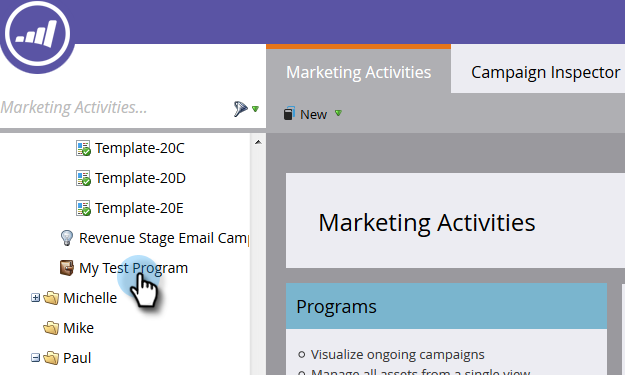

# 모바일 플랫폼 열을 사용하여 사용자 성능 보고서 작성 {#build-a-people-performance-report-with-mobile-platform-columns}

다음 단계에 따라 모바일 플랫폼(iOS/Android)을 사용한 사용자 성능 보고서를 만듭니다.

>[!NOTE]
>
>**FYI**
>
>Marketing은 이제 모든 구독 간의 언어를 표준화하므로 구독에 리드/리드 및 docs.markto.com에 있는 사람/사람을 볼 수 있습니다. 이 용어는 같은 것을 의미한다.아티클 지침에는 영향을 주지 않습니다. 다른 변화도 있습니다 [자세한](http://docs.marketo.com/display/DOCS/Updates+to+Marketo+Terminology)내용

## 모바일 스마트 목록 만들기 {#create-mobile-smart-lists}

1. 마케팅 활동 **으로 이동합니다**.

   

1. 프로그램 선택

   

1. 새로 **만들기**&#x200B;아래에서 **새 로컬 자산을 선택합니다**.

   

1. 스마트 **목록을 클릭합니다**.

   

1. 이름을 입력하고 만들기를 **클릭합니다**.

   

1. 열린 이메일 필터를 찾아 캔버스로 드래그합니다.

   

1. 이메일 **을 모든 이메일 주소로 설정합니다**.

   

1. 제한 **추가를** 클릭하고 **플랫폼을 선택합니다**.

   

   >[!TIP]
   >
   >이 예에서는 열린 이메일 필터를 사용했습니다. 플랫폼 제약 조건으로 클릭한 이메일 필터를 사용할 수도 있습니다.

1. 플랫폼을 **iOS로 설정합니다**.

   

   >[!NOTE]
   >
   >Marketing&#39;s가 이메일을 찾기 위해 iOS 장치에서 이메일 중 하나를 연 사람이 한 명 이상 있어야 합니다. 나타나지 않으면 수동으로 입력하고 저장할 수 있습니다.

   이제 &quot;Android&quot; 플랫폼의 두 번째 스마트 목록을 만듭니다. 그게 끝나면 다음 부분으로 넘어가세요

## 사람 성과 보고서 만들기 {#create-a-people-performance-report}

1. 마케팅 활동에서 **iOS** 및 **Android** 스마트 목록이 포함된 프로그램을 선택합니다.

   

1. 새로 **만들기**&#x200B;아래에서 **새 로컬 자산을 선택합니다**.

   

1. 보고서를 **클릭합니다**.

   

1. 유형을 사람 **성과로 설정합니다**.

   

1. 만들기를 **클릭합니다**.

   

   잘 하고 있어! 이제 다음 섹션으로 넘어갑니다.

## 모바일 스마트 목록을 열로 추가 {#add-mobile-smart-lists-as-columns}

1. 방금 만든 보고서에서 **설정을**&#x200B;클릭한 다음 **사용자 지정 열을** 캔버스로 드래그합니다.

   

   >[!NOTE]
   >
   >기본적으로 사람 성과 보고서는 지난 7일을 보고 있습니다. 일정을 두 번 클릭하여 변경할 수 있습니다.

1. 이전에 만든 스마트 목록을 찾아 선택하고 적용을 **클릭합니다**.

   

1. 보고서 **를** 클릭하여 보고서를 실행하고 데이터를 확인합니다.

   

   꽤 멋지죠? 잘 했어!

