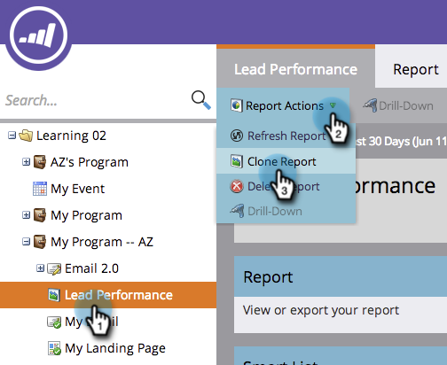

# 보고서 복제 {#clone-a-report}

보고서의 중복을 만들어 원본을 변경하지 않고 추가로 사용자 지정합니다.

1. **[!UICONTROL Marketing Activities]**(또는 **[!UICONTROL Analytics]**) 영역으로 이동합니다.

   

1. 보고서를 선택합니다. **[!UICONTROL Report Actions]** > **[!UICONTROL Clone a Report]**&#x200B;을(를) 선택합니다.

   

   >[!TIP]
   >
   >트리에서 보고서를 마우스 오른쪽 단추로 클릭하여 복제할 수도 있습니다.

1. 보고서 클론 이름을 지정합니다.

   

   이제 복제 맞춤화를 시작할 준비가 되었습니다!

   >[!MORELIKETHIS]
   >
   >[스마트 목록으로 보고서에 있는 사람 필터링](/help/marketo/product-docs/reporting/basic-reporting/editing-reports/filter-people-in-a-report-with-a-smart-list.md)
