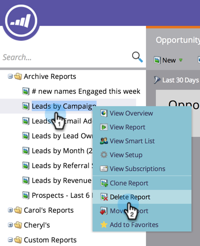

# 보고서 삭제 {#delete-a-report}

일단 보고서 [를](../../../../product-docs/reporting/basic-reporting/creating-reports/create-a-report-in-a-program.md)만들면 많은 보고서를 신속하게 만들 수 있습니다. 더 이상 필요하지 않은 보고서를 삭제해야 합니다.

1. 트리에서 불필요한 보고서를 마우스 오른쪽 단추로 클릭하고 보고서 **삭제를 선택합니다**.

   

1. 보고서 삭제 의도를 확인합니다.

   

   보고서가 트리에서 사라집니다. 지금 오래된 보고서를 제거하십시오!

   >[!NOTE]
   >
   >**딥 다이브**
   >
   >
   >기본 보고 [심층 분석에서 보고서를 사용하여 수행할 수 있는 다른 모든](http://docs.marketo.com/display/docs/basic+reporting) 기능을 살펴볼 수 있습니다.

