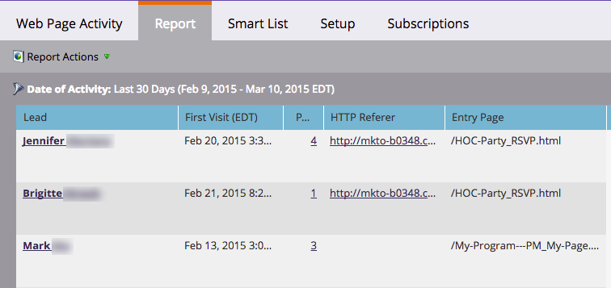

# 웹 보고서에서 사용자 또는 익명 방문자 표시 {#display-people-or-anonymous-visitors-in-web-reports}

>[!PREREQUISITES]
>
>[웹 사이트에 Munchkin 추적 코드 추가](/help/marketo/product-docs/administration/additional-integrations/add-munchkin-tracking-code-to-your-website.md)

[[!UICONTROL Web Page Activity]](/help/marketo/product-docs/reporting/basic-reporting/report-types/web-page-activity-report.md) 및 [[!UICONTROL Company Web Activity] 보고서](/help/marketo/product-docs/reporting/basic-reporting/report-types/company-web-activity-report.md)에서 사이트를 방문하는 [사람 또는 익명 방문자](/help/marketo/product-docs/core-marketo-concepts/smart-lists-and-static-lists/managing-people-in-smart-lists/understanding-anonymous-activity-and-people.md)를 볼 수 있습니다. 익명 방문자는 메트로 에어리어와 같은 데이터를 유추했습니다.  보고서에 알려진 잠재 고객 또는 익명 방문자가 표시되는지 여부를 선택하는 방법은 다음과 같습니다.

1. [!UICONTROL Web Page Activity] 보고서에서 **[!UICONTROL Setup]**&#x200B;을(를) 클릭합니다.

   

1. **[!UICONTROL Activity Source]**&#x200B;을(를) 두 번 클릭합니다.

   

1. 팝업에서 드롭다운에서 **[!UICONTROL Known Leads]**(사용자) 또는 **익명 방문자**&#x200B;를 선택합니다.

   

   >[!NOTE]
   >
   >익명 방문자에 대한 ISP를 포함하면 더 긴 보고서가 생성되지만 익명 방문자를 제외하면 Google과 같은 표준 소스 외에 방문자가 들어오는 위치에 대한 더 명확한 보기를 제공합니다.

1. 다 됐습니다. **[!UICONTROL Report]** 탭을 클릭하여 돌아가서 알려진 사람이나 익명의 사람과 함께 보고서를 확인합니다.

   

>[!MORELIKETHIS]
>
>[익명 활동 및 사용자 추적](/help/marketo/product-docs/reporting/basic-reporting/report-activity/tracking-anonymous-activity-and-people.md)
