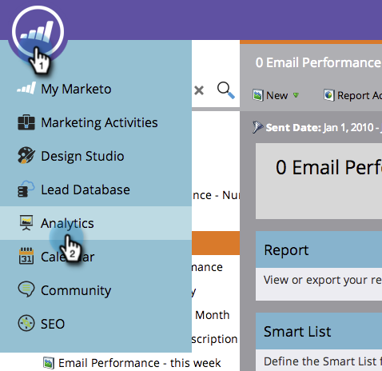

# 캠페인 이메일 보고서의 자산 필터링 {#filter-assets-in-a-campaign-email-reports}

프로그램(&#39; [로컬 자산](../../../../product-docs/reporting/basic-reporting/report-types/campaign-email-performance-report.md) &#39;)이나 보관된 특정 [스마트 캠페인](http://docs.marketo.com/display/docs/smart+campaigns) 등에 캠페인 이메일 성과 보고서를 집중시킬 수 있습니다.

1. **분석 **(또는 **마케팅 활동**) 영역으로 이동합니다.

   

1. 이메일 성능 보고서를 선택합니다.

   

1. 설정 **탭을** 클릭하고 필터 위로 드래그합니다.

   

   * **캠페인**:Marketing To 계정에서 활성 스마트 캠페인
   * **보관된 캠페인**:비활성 상태의 은퇴한 스마트 캠페인

1. 보고서에 포함할 폴더 및 특정 스마트 캠페인을 선택합니다.

   

   >[!TIP]
   >
   >폴더를 선택하면 보고서가 실행될 때 해당 폴더에 포함된 모든 항목이 보고서에 포함됩니다.

1. 이제 끝났어요! 필터링된 보고서 **를** 보려면 보고서 탭을 클릭하십시오.

   

   >[!NOTE]
   >
   >**관련 문서**
   >
   >    
   >    
   >    * [캠페인 이메일 성과 보고서](../../../../product-docs/reporting/basic-reporting/report-types/campaign-email-performance-report.md)
   >    * [이메일 보고서에서 자산 필터링](filter-assets-in-an-email-report.md)

   >[!NOTE]
   >
   >**딥 다이브**
   >
   >
   >기본 보고의 보고서에 대해 [모두 알아봅니다](http://docs.marketo.com/display/docs/basic+reporting).

