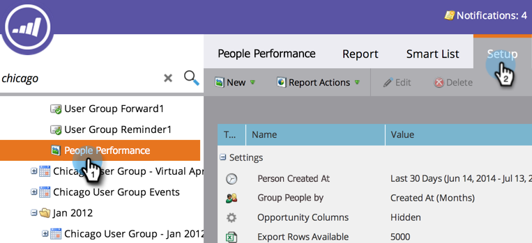

# {#group-person-reports-by-attribute} 속성별 그룹 개인 보고서

개인 또는 회사 특성을 기준으로 [사람 보고서](http://docs.marketo.com/display/docs/basic+reporting)를 그룹화할 수 있습니다.

1. **마케팅 활동**(또는 **분석**) 영역으로 이동합니다.

   

1. 탐색 트리에서 개인 보고서를 선택하고 **설정** 탭을 클릭합니다.

   

1. **Group People by**&#x200B;을 두 번 클릭합니다.

   

   >[!NOTE]
   >
   >또한 [개인 보고서를 세그먼트](../../../../product-docs/personalization/segmentation-and-snippets/segmentation/group-person-reports-by-segment.md)로 그룹화할 수도 있습니다.

   그룹화 기준 대화 상자에서 그룹화에 사용할 개인 또는 회사 속성을 선택합니다.

   

   >[!TIP]
   >
   >*Created At* 또는 *Annual Revenue*&#x200B;과 같은 숫자 값이 있는 속성을 선택하는 경우 오른쪽의 **Units** 드롭다운에서 지표를 선택합니다.

   바로 그거야! 보고서 탭을 클릭하여 그에 따라 그룹화된 보고서를 봅니다.

   

   >[!NOTE]
   >
   >**자세히 알아보기**
   >
   >
   >[기본 보고](http://docs.marketo.com/display/docs/basic+reporting)딥 잠수에서 개인 보고서와 기타 보고서 유형에 대해 자세히 알아보십시오.

   >[!MORELIKETHIS]
   >
   >
   >    
   >    
   >    * [사람 보고서에 사용자 지정 열 추가](../../../../product-docs/reporting/basic-reporting/editing-reports/add-custom-columns-to-a-person-report.md)

