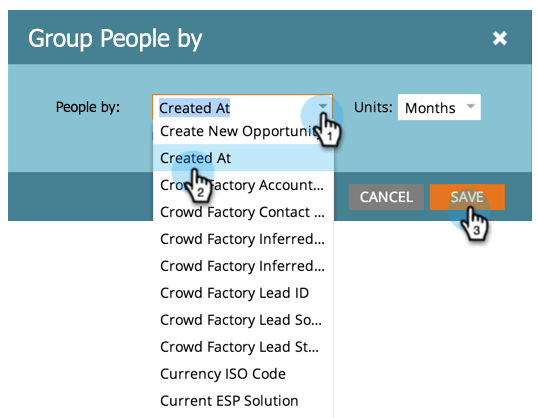

# 속성별 사람 보고서 그룹화 {#group-person-reports-by-attribute}

개인 보고서 [를 개인 또는 회사](http://docs.marketo.com/display/docs/basic+reporting) 속성으로 그룹화할 수 있습니다.

1. 마케팅 활동( **또는** **Analytics**) 영역으로 이동합니다.

   

1. 탐색 트리에서 개인 보고서를 선택하고 설정 **탭을** 클릭합니다.

   

1. [사람 **그룹화 기준]을 두 번 클릭합니다**.

   

   >[!NOTE]
   >
   >개인 보고서를 세그먼트별로 [그룹화할 수도 있습니다](../../../../product-docs/personalization/segmentation-and-snippets/segmentation/group-person-reports-by-segment.md).

   그룹화 기준 대화 상자에서 그룹화에 사용할 개인 또는 회사 속성을 선택합니다.

   

   >[!TIP]
   >
   >만든 위치 또는 *연간 매출* 과 같이 숫자 값이 있는 속성을 선택하는 *경우***오른쪽의 판매량** 드롭다운에서 지표를선택합니다.

   바로 그거야! 보고서 탭을 클릭하여 그에 따라 그룹화된 보고서를 봅니다.

   

   >[!NOTE]
   >
   >**자세히 알아보기**
   >
   >
   >기본 보고의 개인 보고서 및 기타 보고서 유형에 대해 자세히 알아보십시오.

   >[!NOTE]
   >
   >**관련 문서**
   >
   >    
   >    
   >    * [사람 보고서에 사용자 지정 열 추가](../../../../product-docs/reporting/basic-reporting/editing-reports/add-custom-columns-to-a-person-report.md)

