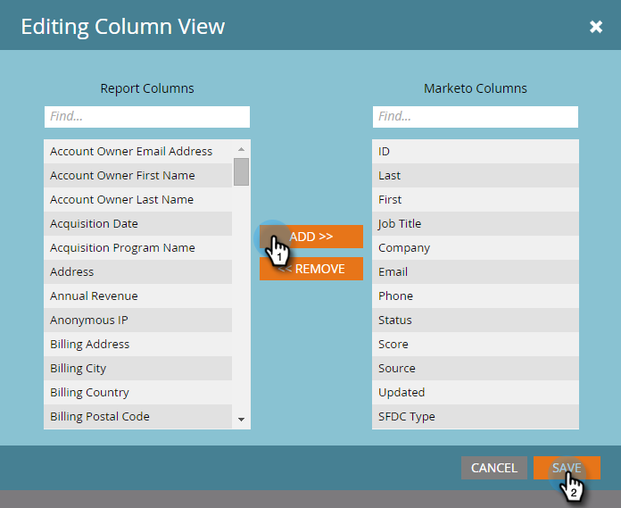

# 스마트 목록 구독 편집 {#edit-a-smart-list-subscription}

마케팅 활동 또는 데이터베이스에 표시되는 구독 탭에서 이러한 열을 직접 편집할 수 있습니다.

* 수신자
* 빈도
* 열
* 게재 종료
* 형식

1. **데이터베이스**&#x200B;을(를) 선택합니다. 이 예제에서는 이 데이터베이스를 사용하고 있지만 마케팅 활동은 정확히 동일하게 작동합니다.

   

1. 편집할 구독을 선택합니다.

   

1. 수신자 열을 클릭하면 더 많은 이메일 주소를 입력할 수 있습니다(쉼표로 구분).

   

1. 설정을 선택하거나 변경하려면 **빈도** 열을 클릭하십시오.

   

1. **열** 열을 열고 선택기를 사용하여 보고서에서 열을 추가하거나 제거합니다. 보고서 열에는 사용 가능한 모든 열이 포함되어 있으며 Marketo 열에는 보고서에 표시하기 위해 선택한 열만 표시됩니다. **저장**&#x200B;을 클릭합니다.

   

   >[!NOTE]
   >
   >Marketo 열 아래의 열은 구독 보고서 탭에 사용되는 열이 아닌 보고서 열입니다.

1. 종료 날짜를 편집하려면 **종료 날짜** 열을 클릭하십시오. **절대 안 함** 또는 **날짜**&#x200B;를 선택하세요. 날짜의 경우 해당 날짜를 입력하거나 달력에서 선택합니다. **승인**&#x200B;을 클릭합니다.

   

1. 퍼즐의 마지막 조각은 형식이다. **서식** 열을 클릭하고 원하는 열을 선택합니다. CSV가 기본값입니다.

   
