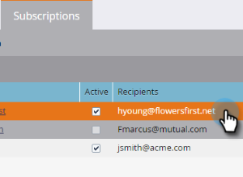
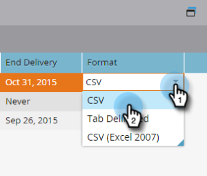

# 스마트 목록 구독 편집 {#edit-a-smart-list-subscription}

마케팅 활동 또는 데이터베이스에 표시되는 가입 탭에서 직접 이러한 열을 편집할 수 있습니다.

* 받는 사람
* 빈도
* 열
* 배달 종료
* 형식

1. **데이터베이스**&#x200B;를 선택합니다(이 예에서는 이 데이터베이스를 사용하지만 마케팅 활동은 정확히 동일하게 작동합니다.).

   

1. 편집할 구독을 선택합니다.

   

1. [수신자] 열을 클릭하면 추가 이메일 주소를 입력할 수 있습니다(쉼표로 구분하여).

   

1. **빈도** 열을 클릭하여 설정을 선택하거나 변경합니다.

   

1. **열** 열을 열고 선택기를 사용하여 보고서에서 열을 추가하거나 제거합니다. 보고서 열에는 사용할 수 있는 열이 모두 포함되며 마케팅 열은 보고서에 표시하도록 선택한 열만 표시합니다. **저장**&#x200B;을 클릭합니다.

   

   >[!NOTE]
   >
   >[Marketing To 열] 아래의 열은 구독 보고서 탭에 사용된 열이 아니라 보고서 열입니다.

1. 종료 날짜&#x200B;**열을 클릭하여 종료 날짜를 편집합니다.** **안 함** 또는 **날짜**&#x200B;를 선택합니다. 날짜에 대해 해당 날짜를 입력하거나 달력에서 선택합니다. **승인**&#x200B;을 클릭합니다.

   

1. 퍼즐의 마지막 부분은 포맷이다. **형식** 열을 클릭하고 원하는 열을 선택합니다. CSV가 기본값입니다.

   

