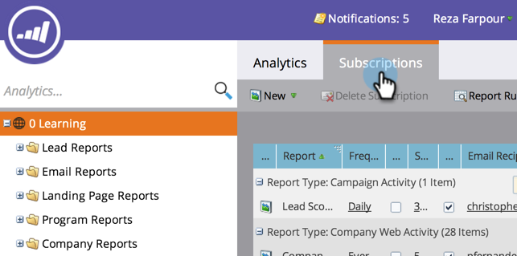

# 보고서 구독 관리 {#manage-report-subscriptions}

보고서 구독을 구성하고 삭제합니다.

1. 로 이동합니다. **Analytics** 영역.

   

1. 을(를) 클릭합니다. **구독** 탭.

   

   이 페이지에는 계정을 기준으로 그룹화된 모든 보고서에 대한 가입이 표시됩니다 [보고서 유형](/help/marketo/product-docs/reporting/basic-reporting/report-types/report-type-overview.md). 여기에는 다음이 포함됩니다 [기본 보고서에 대한 구독](/help/marketo/product-docs/reporting/basic-reporting/report-subscriptions/subscribe-to-a-basic-report.md) 및에 전송됩니다.

   >[!TIP]
   >
   >또한 의 개별 보고서에 대한 구독을 관리할 수도 있습니다 **마케팅 활동**. 보고서를 선택하고 **구독** 탭.

   보고서 이메일 빈도를 변경하려면 빈도 필드를 클릭하고 드롭다운 메뉴에서 새 옵션을 선택합니다.

   

1. 구독에서 이메일 주소를 변경하려면 **전자 메일 수신자** 필드를 작성하고 이메일 주소를 편집합니다.

   

   >[!TIP]
   >
   >* 이메일 주소 사이에 쉼표를 사용하십시오.
   >* 편집 내용을 저장하려면 영역을 클릭합니다 _외부_ 구독 목록.

   다음을 수행할 수도 있습니다.

   * 을(를) 클릭합니다. **보기** 단추를 클릭하여 보고서를 엽니다.
   * 선택 취소 **활성** 확인란을 선택하여 구독을 비활성화합니다.
   * 을(를) 클릭하고 을(를) 편집합니다 **요약** 전자 메일에 표시되는 미리 보기 행의 수를 변경하는 필드입니다.
   * 선택 취소 **Excel** 스프레드시트 첨부 없이 보고서 요약을 전송하는 확인란입니다.
   * 을(를) 클릭합니다. **보내기** 버튼을 클릭하여 보고서 이메일을 즉시 보냅니다.

1. 구독을 모두 삭제하려면 행을 선택하고 **구독 삭제**.

   

1. 구독을 삭제할 의도를 확인합니다.

   

   >[!MORELIKETHIS]
   >
   >* [기본 보고서 구독](/help/marketo/product-docs/reporting/basic-reporting/report-subscriptions/subscribe-to-a-basic-report.md)
   >* [매출 탐색기 보고서 구독](/help/marketo/product-docs/reporting/revenue-cycle-analytics/revenue-explorer/subscribe-to-a-revenue-explorer-report.md)

